# UNIVERSIDAD PRIVADA DE TACNA

## FACULTAD DE INGENIERIA

### Escuela Profesional de Ingenieria de Sistemas

---

# Proyecto: Simulador de Bases de Datos

**Curso:** Calidad y Pruebas de Software

**Docente:** MAG. Patrick Cuadros Quiroga

**Integrantes:**

- Jhony Vargas Luque (2022075754)
- Abel Fernando Pacompia Ortiz (2023076797)

**Tacna - Peru**

**2026**

---

## CONTROL DE VERSIONES

| Version | Hecha por | Revisada por | Aprobada por | Fecha | Motivo |
|---|---|---|---|---|---|
| 1.0 | APO, JVL | APO, JVL | P. Cuadros Q. | 2026-04-20 | Version inicial |
| 2.0 | APO, JVL | APO, JVL | P. Cuadros Q. | 2026-06-21 | Adaptacion a la implementacion final |
| 2.1 | APO, JVL | APO, JVL | P. Cuadros Q. | 2026-07-04 | Actualizacion con codigo actual, CI/CD y GitHub Actions |

---

# Sistema Simulador de Bases de Datos

## Documento de Especificacion de Requerimientos de Software

**Version 2.1**

---

## INDICE GENERAL

1. [INTRODUCCION](#introduccion)
2. [I. GENERALIDADES DEL PROYECTO](#i-generalidades-del-proyecto)
   1. [Nombre del Proyecto](#1-nombre-del-proyecto)
   2. [Vision](#2-vision)
   3. [Mision](#3-mision)
   4. [Organigrama del Proyecto](#4-organigrama-del-proyecto)
3. [II. VISIONAMIENTO DEL SISTEMA](#ii-visionamiento-del-sistema)
   1. [Descripcion del Problema](#1-descripcion-del-problema)
   2. [Objetivos de Negocio](#2-objetivos-de-negocio)
   3. [Objetivos de Diseno](#3-objetivos-de-diseno)
   4. [Alcance del Proyecto](#4-alcance-del-proyecto)
   5. [Viabilidad del Sistema](#5-viabilidad-del-sistema)
   6. [Informacion Obtenida del Levantamiento de Informacion](#6-informacion-obtenida-del-levantamiento-de-informacion)
4. [III. ANALISIS DE PROCESOS](#iii-analisis-de-procesos)
   1. [Diagrama del Proceso Actual](#a-diagrama-del-proceso-actual---diagrama-de-actividades)
   2. [Diagrama del Proceso Propuesto](#b-diagrama-del-proceso-propuesto---diagrama-de-actividades)
5. [IV. ESPECIFICACION DE REQUERIMIENTOS DE SOFTWARE](#iv-especificacion-de-requerimientos-de-software)
   1. [Cuadro de Requerimientos Funcionales Inicial](#a-cuadro-de-requerimientos-funcionales-inicial)
   2. [Cuadro de Requerimientos No Funcionales](#b-cuadro-de-requerimientos-no-funcionales)
   3. [Cuadro de Requerimientos Funcionales Final](#c-cuadro-de-requerimientos-funcionales-final)
   4. [Reglas de Negocio](#d-reglas-de-negocio)
6. [V. FASE DE DESARROLLO](#v-fase-de-desarrollo)
   1. [Perfiles de Usuario](#1-perfiles-de-usuario)
   2. [Modelo Conceptual](#2-modelo-conceptual)
      1. [Diagrama de Paquetes](#a-diagrama-de-paquetes)
      2. [Diagrama de Contexto](#a1-diagrama-de-contexto)
      3. [Diagrama de Casos de Uso](#b-diagrama-de-casos-de-uso)
      4. [Diagramas de Casos de Uso Especificos](#b1-diagramas-de-casos-de-uso-especificos)
      5. [Escenarios de Caso de Uso](#c-escenarios-de-caso-de-uso)
   3. [Modelo Logico](#3-modelo-logico)
      1. [Analisis de Objetos](#a-analisis-de-objetos)
      2. [Diagrama de Actividades con Objetos](#b-diagrama-de-actividades-con-objetos)
      3. [Diagrama de Flujo de Datos](#b1-diagrama-de-flujo-de-datos)
      4. [Diagrama de Secuencia General](#c-diagrama-de-secuencia-general)
      5. [Diagrama de Clases](#d-diagrama-de-clases)
   4. [Artefactos de requisitos complementarios](#4-artefactos-de-requisitos-complementarios)
      1. [Diagrama Entidad-Relacion Preliminar](#a-diagrama-entidad-relacion-preliminar)
      2. [Diagrama de Estados](#b-diagrama-de-estados)
      3. [Matriz de Trazabilidad de Requisitos](#c-matriz-de-trazabilidad-de-requisitos)
      4. [Prototipos o Wireframes de Pantallas Principales](#d-prototipos-o-wireframes-de-pantallas-principales)
7. [CONCLUSIONES](#conclusiones)
8. [RECOMENDACIONES](#recomendaciones)
9. [REFERENCIAS BIBLIOGRAFICAS](#referencias-bibliograficas)

---

# INTRODUCCION

El presente documento especifica los requerimientos de software para el **Simulador de Bases de Datos**, una solucion academica orientada a la practica de consultas SQL y NoSQL sin instalar motores reales.

El sistema integra un entorno tipo IDE con editor Monaco, multiples motores simulados, importacion y exportacion de datos, persistencia local mediante IndexedDB, simulador de carga y panel administrativo. Su finalidad es facilitar el aprendizaje de bases de datos, pruebas y analisis de rendimiento en un contexto controlado.

Los principales problemas que atiende son:

- Dificultad para instalar y configurar multiples motores de base de datos.
- Falta de un entorno unico para practicar SQL Server, MySQL, PostgreSQL, Oracle, SQLite, MongoDB y Redis.
- Necesidad de importar datos de prueba y exportar evidencias.
- Riesgo de modificar bases reales durante practicas academicas.
- Falta de herramientas simples para simular carga y comparar motores de forma didactica.

---

# I. GENERALIDADES DEL PROYECTO

## 1. Nombre del Proyecto

**Simulador de Bases de Datos** es una aplicacion web y desktop para practicar consultas, explorar esquemas, importar/exportar datos y simular carga sobre motores de base de datos representados dentro del navegador.

## 2. Vision

Ser una herramienta academica accesible para que estudiantes y docentes practiquen consultas SQL y NoSQL, comparen sintaxis entre motores y comprendan conceptos de rendimiento sin depender de instalaciones complejas.

## 3. Mision

Proporcionar un entorno integrado, didactico y local que permita:

- Ejecutar consultas de practica.
- Trabajar con multiples motores simulados.
- Importar y exportar evidencias.
- Explorar estructuras de datos.
- Simular carga y saturacion.
- Apoyar la evaluacion academica del aprendizaje.

## 4. Organigrama del Proyecto

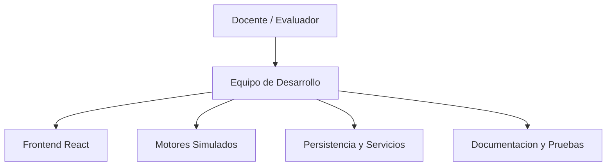

---

# II. VISIONAMIENTO DEL SISTEMA

## 1. Descripcion del Problema

### Situacion Actual

En cursos de bases de datos y desarrollo de software, los estudiantes suelen necesitar varios motores para practicar. Esto genera barreras tecnicas y operativas:

1. **Instalacion compleja:**
   - Cada motor requiere instalacion, configuracion, puertos y credenciales.
   - Oracle, SQL Server, PostgreSQL, MySQL, MongoDB y Redis tienen flujos distintos.

2. **Fragmentacion de herramientas:**
   - Se usan clientes diferentes para cada tecnologia.
   - El estudiante pierde tiempo cambiando de entorno.

3. **Datos de prueba dispersos:**
   - Importar CSV, JSON o scripts SQL suele depender de herramientas externas.
   - Exportar evidencias no siempre es inmediato.

4. **Riesgo en bases reales:**
   - Practicar `DROP`, `UPDATE` o `DELETE` sobre bases reales puede causar perdida de datos.

5. **Dificultad para explicar rendimiento:**
   - Simular usuarios, TPS, latencia y saturacion requiere infraestructura adicional.

### Impacto Academico

- Mayor tiempo de preparacion antes de practicar.
- Menor concentracion en la logica de consultas.
- Dificultad para comparar dialectos.
- Menos evidencias exportables para evaluacion.
- Dependencia de equipos con suficiente capacidad para instalar motores reales.

## 2. Objetivos de Negocio

### Objetivos Generales

1. **Reducir la complejidad de practica:**
   - Permitir practicar desde un navegador o app desktop.
   - Evitar la instalacion de multiples motores para ejercicios iniciales.

2. **Centralizar el aprendizaje:**
   - Reunir SQL y NoSQL en un solo entorno.
   - Facilitar comparacion de motores y sintaxis.

3. **Mejorar la evidencia academica:**
   - Exportar resultados, esquemas, sesiones y logs.
   - Mantener historial de consultas y simulaciones.

4. **Introducir conceptos de rendimiento:**
   - Simular TPS, latencia, CPU, errores y conexiones.
   - Comparar comportamiento estimado entre motores.

### Objetivos Especificos

- Ejecutar consultas SQL en memoria mediante AlaSQL.
- Simular comandos basicos de MongoDB y Redis.
- Soportar importacion de SQL, CSV y JSON.
- Persistir tablas localmente en IndexedDB.
- Exportar resultados a CSV, JSON y Excel.
- Implementar simulacion de carga normal, comparativa y progresiva.
- Monitorear sesiones desde un panel administrativo.

## 3. Objetivos de Diseno

1. **Interfaz intuitiva:**
   - Editor central, tabs por motor, resultados visibles y modales especializados.

2. **Arquitectura modular:**
   - Separacion entre componentes React, store global, motores, persistencia y servicios.

3. **Portabilidad:**
   - Ejecucion web con Vite y version desktop con Electron.

4. **Extensibilidad:**
   - Posibilidad de agregar nuevos motores, exportadores o plantillas.

5. **Seguridad academica:**
   - Ejecucion local sin afectar bases reales.
   - Autenticacion y roles para funciones administrativas.

## 4. Alcance del Proyecto

### Incluido en el Proyecto

- Aplicacion principal tipo IDE.
- Editor Monaco para consultas.
- Motores simulados: SQL Server, MySQL, PostgreSQL, Oracle, SQLite, MongoDB y Redis.
- Importacion de archivos `.sql`, `.csv` y `.json`.
- Exportacion de resultados en CSV, JSON y Excel.
- Exportacion de esquemas y bases completas.
- Persistencia local con IndexedDB.
- Historial y logs de consultas.
- Simulador de carga con metricas estimadas.
- Panel administrativo con monitoreo de sesiones y roles.
- Despliegue web y empaquetado Electron.
- CI/CD con GitHub Actions para pruebas de rendimiento y despliegue de landing.

### No Incluido en el Proyecto

- Conexion real a servidores de base de datos.
- Compatibilidad completa con todos los dialectos SQL.
- Ejecucion real de procedimientos almacenados, triggers o funciones avanzadas.
- Benchmark real de motores productivos.
- Persistencia empresarial multiusuario para datos importados.

### Limites y Restricciones

- Los datos principales se guardan en el navegador del usuario.
- MongoDB y Redis son simulaciones sobre estructuras en memoria.
- Firebase debe configurarse para autenticacion, presencia y administracion.
- El simulador de carga calcula metricas estimadas, no mediciones reales.
- La compatibilidad SQL depende de AlaSQL y de los preprocesadores implementados.

## 5. Viabilidad del Sistema

### Viabilidad Tecnica

**Alta.** El sistema utiliza tecnologias maduras y disponibles:

- React 18 y TypeScript.
- Vite.
- Tailwind CSS.
- Monaco Editor.
- AlaSQL.
- IndexedDB.
- Zustand.
- Firebase.
- Electron.

### Viabilidad Economica

**Alta.** No se requieren licencias comerciales. El costo principal corresponde al tiempo academico de desarrollo, internet, energia y documentacion.

### Viabilidad Operativa

**Alta.** El usuario puede ejecutar el sistema con:

```bash
npm install
npm run dev
```

Ademas, puede generar una version desktop mediante los scripts Electron definidos en `package.json`.

## 6. Informacion Obtenida del Levantamiento de Informacion

### Fuentes de Informacion

1. **Analisis del codigo implementado:**
   - Componentes React.
   - Store Zustand.
   - Motor `sqlEngine.ts`.
   - Persistencia IndexedDB.
   - Servicios Firebase.

2. **Revision del README:**
   - Caracteristicas principales.
   - Motores soportados.
   - Limitaciones conocidas.

3. **Necesidades academicas:**
   - Practicar consultas sin instalacion.
   - Exportar evidencias.
   - Simular carga.

### Requisitos del Cliente

- Soportar multiples motores.
- Tener una interfaz parecida a un IDE.
- Permitir importacion y exportacion.
- Mostrar resultados claros.
- Guardar historial.
- Simular rendimiento.
- Contar con documentacion del sistema.

---

# III. ANALISIS DE PROCESOS

## a) Diagrama del Proceso Actual - Diagrama de Actividades

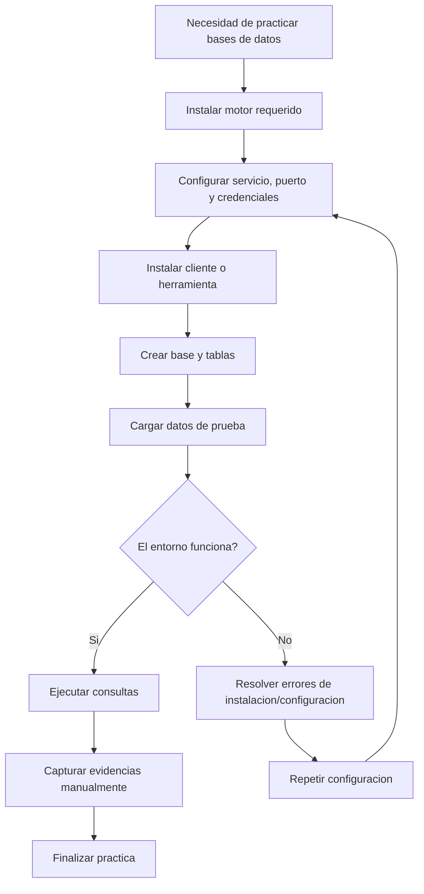

**Problemas identificados:**

- Alto tiempo de preparacion.
- Dependencia de instalaciones locales.
- Herramientas distintas por motor.
- Evidencias manuales y dispersas.
- Riesgo de afectar datos reales.

## b) Diagrama del Proceso Propuesto - Diagrama de Actividades

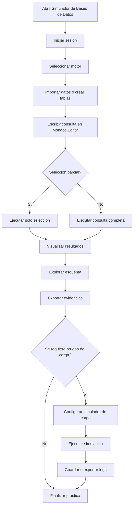

**Mejoras del proceso propuesto:**

- Menor tiempo de inicio.
- Entorno unico para varios motores.
- Importacion/exportacion integrada.
- Resultados y esquema en una sola interfaz.
- Simulacion de carga sin infraestructura adicional.

---

# IV. ESPECIFICACION DE REQUERIMIENTOS DE SOFTWARE

## a) Cuadro de Requerimientos Funcionales Inicial

| ID | Requerimiento | Descripcion | Prioridad | Estado |
|---|---|---|---|---|
| RF001 | Editor de consultas | El sistema debe permitir escribir consultas SQL/NoSQL. | Alta | Aprobado |
| RF002 | Motores multiples | Debe soportar al menos cinco motores de base de datos. | Alta | Aprobado |
| RF003 | Ejecucion local | Debe ejecutar consultas sin servidores reales. | Alta | Aprobado |
| RF004 | Importacion | Debe importar datos desde archivos. | Alta | Aprobado |
| RF005 | Exportacion | Debe exportar resultados de consulta. | Alta | Aprobado |
| RF006 | Explorador de esquema | Debe listar tablas y columnas creadas. | Media | Aprobado |
| RF007 | Historial | Debe guardar consultas ejecutadas. | Media | Aprobado |
| RF008 | Simulacion | Debe simular condiciones de carga. | Media | Aprobado |
| RF009 | Administracion | Debe permitir monitoreo de sesiones. | Media | Aprobado |
| RF010 | Desktop | Debe poder empaquetarse como aplicacion de escritorio. | Baja | Aprobado |

## b) Cuadro de Requerimientos No Funcionales

| ID | Requerimiento | Descripcion | Metrica | Prioridad |
|---|---|---|---|---|
| RNF001 | Usabilidad | Interfaz comprensible para estudiantes. | Flujo principal sin capacitacion extensa. | Alta |
| RNF002 | Rendimiento | Consultas de laboratorio deben responder de forma fluida. | Datasets pequenos/medianos en segundos. | Alta |
| RNF003 | Portabilidad | Ejecucion web y desktop. | Vite + Electron. | Media |
| RNF004 | Mantenibilidad | Codigo organizado por componentes y servicios. | Modulos separados. | Alta |
| RNF005 | Auditabilidad | Consultas y pruebas deben dejar evidencia. | Historial, logs y exportaciones. | Media |
| RNF006 | Configurabilidad | Parametros de editor y simulacion ajustables. | Modales de configuracion. | Media |
| RNF007 | Seguridad | Acceso admin controlado por roles. | Firebase Auth/roles. | Media |
| RNF008 | Compatibilidad | Funcionamiento en navegadores modernos. | Chrome, Edge, Firefox. | Media |
| RNF009 | Claridad | Comunicar que los motores son simulados. | README/documentacion. | Alta |
| RNF010 | Persistencia local | Conservar tablas entre sesiones del navegador. | IndexedDB. | Media |
| RNF011 | Integracion continua | Validar build y rendimiento simulado en GitHub Actions. | Workflow `Database Load Performance`. | Media |

## c) Cuadro de Requerimientos Funcionales Final

| ID | Requerimiento | Descripcion Detallada | Modulo | Estado |
|---|---|---|---|---|
| RF001 | Autenticacion | Permite login, registro y sesiones de usuario. | `LoginScreen`, `auth.ts` | Implementado |
| RF002 | Editor Monaco | Permite escribir consultas con experiencia tipo IDE. | `SQLEditor` | Implementado |
| RF003 | Tabs por motor | Permite crear y cambiar pestanas por motor. | `EngineTabs`, `useStore` | Implementado |
| RF004 | SQL relacional | Ejecuta consultas SQL en memoria con AlaSQL. | `sqlEngine.ts` | Implementado |
| RF005 | Preprocesamiento SQL Server | Adapta sentencias comunes de SQL Server. | `preprocessSQL` | Implementado |
| RF006 | MongoDB simulado | Ejecuta `find`, `insertOne`, `updateOne`, `deleteOne`, entre otros. | `executeMongoQuery` | Implementado |
| RF007 | Redis simulado | Ejecuta comandos clave-valor, hashes, listas y sets. | `executeRedisCommand` | Implementado |
| RF008 | Importar CSV | Crea tablas desde archivos CSV. | `importTableFromCSV` | Implementado |
| RF009 | Importar JSON | Crea tablas desde JSON. | `importTableFromJSON` | Implementado |
| RF010 | Importar SQL | Procesa scripts SQL y crea tablas. | `importTableFromSQL` | Implementado |
| RF011 | Persistencia local | Guarda tablas y esquemas en IndexedDB. | `idbStorage.ts` | Implementado |
| RF012 | Resultados | Muestra resultados tabulares y multiples sets. | `ResultsPanel` | Implementado |
| RF013 | Exportacion | Exporta CSV, JSON, Excel, SQL y formatos por motor. | `ExportModal`, `exportHelper` | Implementado |
| RF014 | Explorador de esquema | Lista bases, tablas, columnas y preview. | `SchemaExplorer` | Implementado |
| RF015 | Historial y logs | Guarda consultas, errores y tiempos de ejecucion. | `HistoryModal`, `queryLogger` | Implementado |
| RF016 | Configuracion | Ajusta tema, editor y parametros de entorno. | `SettingsModal`, `EnvModal` | Implementado |
| RF017 | Simulador de carga | Simula usuarios, TPS, latencia, CPU y errores. | `LoadSimulatorModal` | Implementado |
| RF018 | Comparacion de motores | Compara metricas de dos motores simulados. | `LoadSimulatorModal` | Implementado |
| RF019 | Modo progresivo | Incrementa usuarios hasta saturacion simulada. | `LoadSimulatorModal` | Implementado |
| RF020 | Panel admin | Monitorea sesiones y gestiona roles. | `AdminApp` | Implementado |
| RF021 | Presencia | Muestra usuarios conectados y motor activo. | `presence.ts` | Implementado |
| RF022 | Desktop | Empaqueta la aplicacion con Electron. | `electron/main.cjs` | Implementado |
| RF023 | CI/CD rendimiento | Ejecuta matriz de carga para 7 motores y 3 escenarios. | `.github/workflows/performance.yml` | Implementado |
| RF024 | Despliegue landing | Publica la landing estatica del proyecto en GitHub Pages. | `.github/workflows/pages.yml` | Implementado |

## d) Reglas de Negocio

### Reglas Generales

| ID | Regla |
|---|---|
| RN001 | El usuario debe iniciar sesion para acceder al IDE principal. |
| RN002 | Cada pestana pertenece a un solo motor. |
| RN003 | Si existe seleccion de texto, se ejecuta solo la seleccion. |
| RN004 | Si no existe seleccion, se ejecuta la consulta completa del panel activo. |
| RN005 | Los cambios DDL/DML deben actualizar el explorador de esquema. |

### Reglas de Motores

| ID | Regla |
|---|---|
| RM001 | Los motores relacionales usan AlaSQL como base de ejecucion en memoria. |
| RM002 | SQL Server requiere preprocesamiento para adaptar `GO`, `IDENTITY`, tipos y restricciones. |
| RM003 | MongoDB simulado opera sobre colecciones equivalentes a tablas en memoria. |
| RM004 | Redis simulado mantiene estructuras internas de string, hash, list y set. |
| RM005 | SQLite, MySQL, PostgreSQL y Oracle comparten ejecucion local con ajustes de sintaxis cuando aplica. |

### Reglas de Exportacion

| ID | Regla |
|---|---|
| RE001 | Los resultados pueden exportarse a CSV, JSON y Excel. |
| RE002 | El esquema puede exportarse como DDL o JSON. |
| RE003 | La base completa se exporta con formato segun motor activo. |
| RE004 | Los logs de simulacion pueden exportarse a JSON y CSV. |

### Reglas de Simulacion

| ID | Regla |
|---|---|
| RS001 | TPS, latencia, CPU y errores son estimaciones. |
| RS002 | El factor de rendimiento depende del motor seleccionado. |
| RS003 | En modo comparacion se calculan metricas para dos motores. |
| RS004 | En modo progresivo se incrementan usuarios hasta completar o detectar saturacion. |

### Reglas de CI/CD

| ID | Regla |
|---|---|
| RC001 | El workflow de rendimiento se ejecuta en `push`, `pull_request` y `workflow_dispatch`. |
| RC002 | Antes de probar rendimiento se debe ejecutar `npm run build`. |
| RC003 | La matriz de rendimiento debe cubrir `sqlserver`, `mysql`, `postgresql`, `oracle`, `sqlite`, `mongodb` y `redis`. |
| RC004 | Cada motor debe probarse en escenarios `light`, `medium` y `heavy`. |
| RC005 | Los resultados deben generar artifacts individuales y un resumen consolidado. |
| RC006 | En Pull Requests el resumen consolidado debe publicarse como comentario automatico. |

---

# V. FASE DE DESARROLLO

## 1. Perfiles de Usuario

### Perfil 1: Estudiante

| Campo | Descripcion |
|---|---|
| Objetivo | Practicar consultas SQL/NoSQL y generar evidencias. |
| Necesidades | Editor, resultados, importacion, exportacion y ayuda. |
| Funciones usadas | IDE, importacion, resultados, historial, simulador. |

### Perfil 2: Docente

| Campo | Descripcion |
|---|---|
| Objetivo | Evaluar funcionalidad, evidencias y documentacion. |
| Necesidades | Informes, capturas, exportaciones y pruebas reproducibles. |
| Funciones usadas | Reportes, exportacion, simulador, panel admin. |

### Perfil 3: Administrador

| Campo | Descripcion |
|---|---|
| Objetivo | Monitorear sesiones y gestionar roles. |
| Necesidades | Login admin, tabla de usuarios y sesiones activas. |
| Funciones usadas | `AdminApp`, Firebase Auth, Realtime Database. |

### Perfil 4: Desarrollador

| Campo | Descripcion |
|---|---|
| Objetivo | Mantener y extender el sistema. |
| Necesidades | Codigo modular, tipos claros, componentes reutilizables. |
| Funciones usadas | Motores, store, componentes, servicios Firebase. |

## 2. Modelo Conceptual

### a) Diagrama de Paquetes

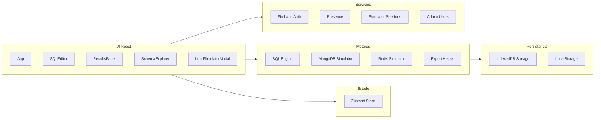

### a.1) Diagrama de Contexto

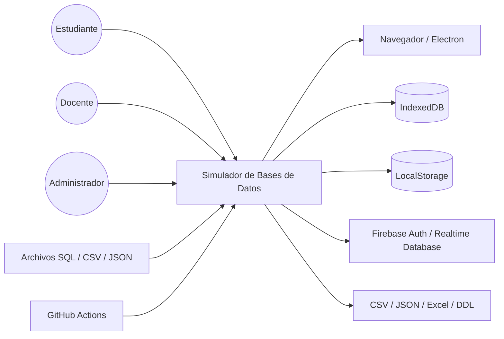

### b) Diagrama de Casos de Uso

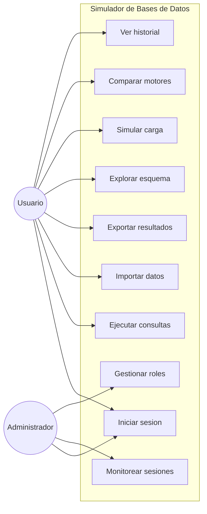

### b.1) Diagramas de Casos de Uso Especificos

#### Caso de uso especifico: Practica de consultas

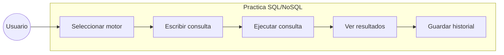

#### Caso de uso especifico: Gestion de datos

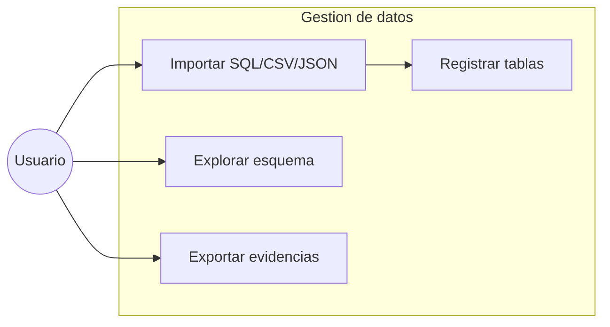

#### Caso de uso especifico: Administracion y monitoreo

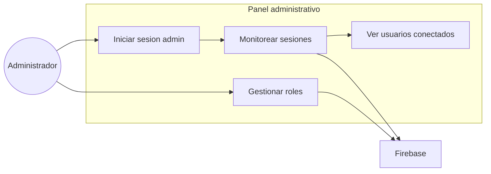

### c) Escenarios de Caso de Uso

#### Caso de Uso 1: Iniciar sesion

| Campo | Descripcion |
|---|---|
| Actor | Usuario |
| Precondicion | Usuario registrado o con credenciales validas. |
| Flujo principal | Ingresa credenciales, el sistema valida autenticacion y carga la sesion. |
| Flujo alterno | Si las credenciales son invalidas, se muestra mensaje de error. |
| Postcondicion | Usuario autenticado accede al IDE, simulador o panel segun su rol. |

**Diagrama de secuencia**

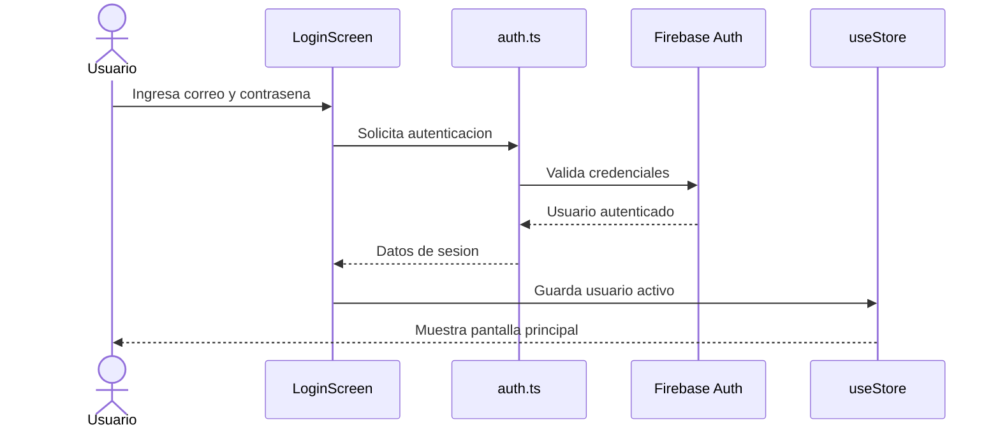

#### Caso de Uso 2: Ejecutar consultas

| Campo | Descripcion |
|---|---|
| Actor | Usuario |
| Precondicion | Usuario autenticado y con una pestana activa. |
| Flujo principal | Selecciona motor, escribe consulta, ejecuta, revisa resultados. |
| Flujo alterno | Si selecciona texto, solo se ejecuta la seleccion. |
| Postcondicion | Resultado y mensajes quedan visibles; la consulta puede registrarse en historial. |

**Diagrama de secuencia**

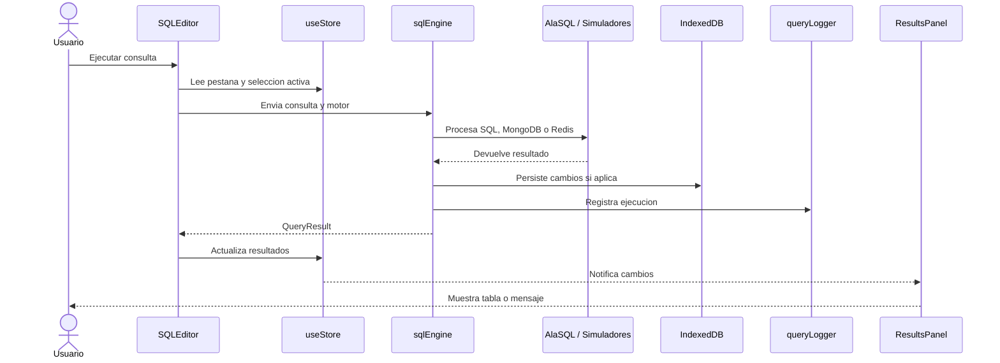

#### Caso de Uso 3: Importar datos

| Campo | Descripcion |
|---|---|
| Actor | Usuario |
| Precondicion | Usuario dentro del IDE. |
| Flujo principal | Abre modal, elige SQL/CSV/JSON, carga archivo y confirma. |
| Flujo alterno | Si el archivo no tiene formato valido, se muestra error de importacion. |
| Postcondicion | Las tablas aparecen en el explorador de esquema y quedan disponibles para consulta. |

**Diagrama de secuencia**

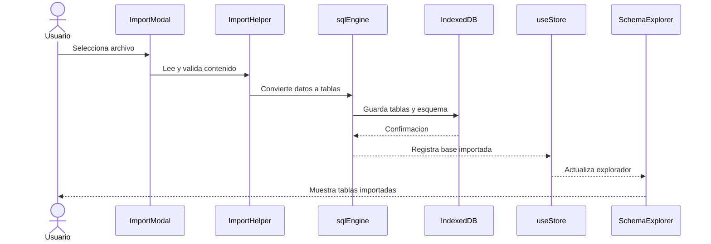

#### Caso de Uso 4: Exportar resultados

| Campo | Descripcion |
|---|---|
| Actor | Usuario |
| Precondicion | Existe un resultado, esquema o base disponible para exportar. |
| Flujo principal | Abre modal de exportacion, selecciona formato y descarga el archivo. |
| Flujo alterno | Si no hay datos disponibles, el sistema informa que no se puede exportar. |
| Postcondicion | El usuario obtiene el archivo de evidencia en el formato seleccionado. |

**Diagrama de secuencia**

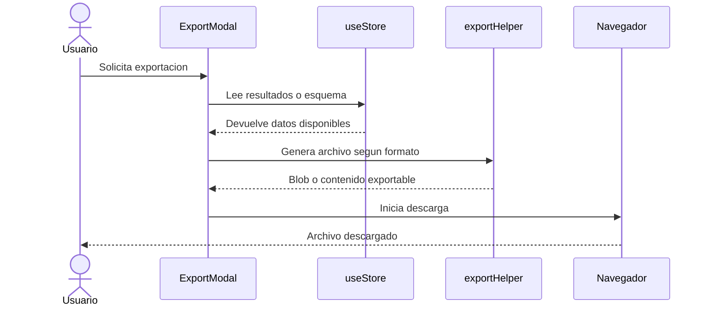

#### Caso de Uso 5: Explorar esquema

| Campo | Descripcion |
|---|---|
| Actor | Usuario |
| Precondicion | Existen tablas creadas o importadas. |
| Flujo principal | Abre el explorador, selecciona base/tabla y revisa columnas o vista previa. |
| Flujo alterno | Si no hay tablas, el sistema muestra estado vacio. |
| Postcondicion | Usuario identifica estructuras disponibles para nuevas consultas. |

**Diagrama de secuencia**

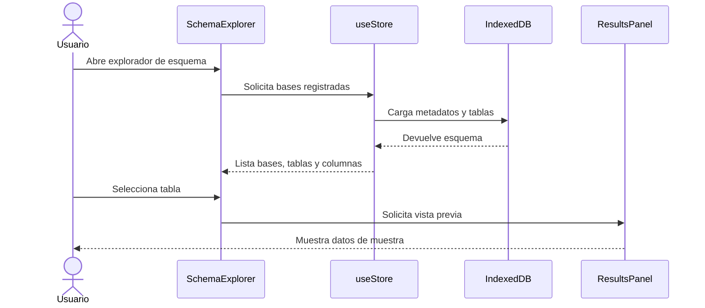

#### Caso de Uso 6: Simular carga

| Campo | Descripcion |
|---|---|
| Actor | Usuario |
| Precondicion | Usuario dentro del IDE o simulador standalone. |
| Flujo principal | Configura motor, usuarios, duracion y tipos de consulta; inicia prueba. |
| Flujo alterno | Si los parametros son invalidos, se solicita corregir la configuracion. |
| Postcondicion | Se muestran metricas y logs; puede guardarse historial. |

**Diagrama de secuencia**

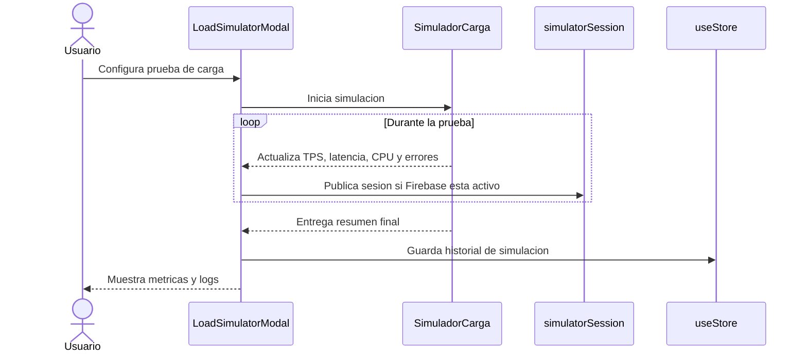

#### Caso de Uso 7: Comparar motores

| Campo | Descripcion |
|---|---|
| Actor | Usuario |
| Precondicion | Usuario accede al modulo de simulacion de carga. |
| Flujo principal | Selecciona dos motores, ejecuta comparacion y revisa metricas. |
| Flujo alterno | Si ambos motores son iguales, se solicita seleccionar motores distintos. |
| Postcondicion | Se muestran diferencias estimadas de TPS, latencia, errores y CPU. |

**Diagrama de secuencia**

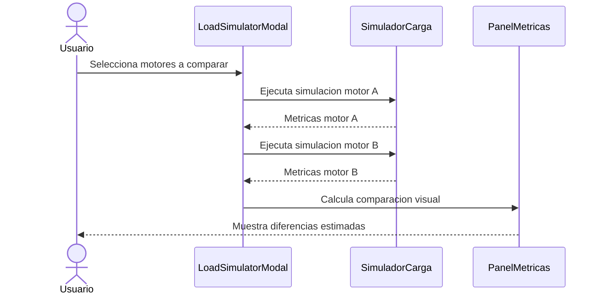

#### Caso de Uso 8: Ver historial

| Campo | Descripcion |
|---|---|
| Actor | Usuario |
| Precondicion | Existen consultas o simulaciones registradas. |
| Flujo principal | Abre historial y revisa consultas, resultados o logs previos. |
| Flujo alterno | Si no hay registros, se muestra historial vacio. |
| Postcondicion | Usuario puede reutilizar consultas o revisar evidencias anteriores. |

**Diagrama de secuencia**

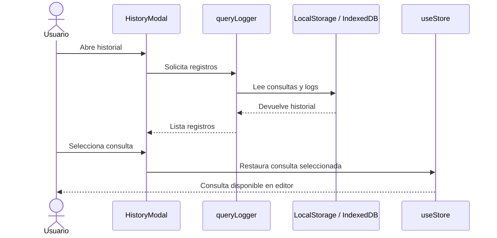

#### Caso de Uso 9: Monitorear sesiones

| Campo | Descripcion |
|---|---|
| Actor | Administrador |
| Precondicion | Usuario con rol administrador y Firebase configurado. |
| Flujo principal | Ingresa a `admin.html`, revisa sesiones y usuarios. |
| Postcondicion | Puede cambiar roles y observar actividad en vivo. |

**Diagrama de secuencia**

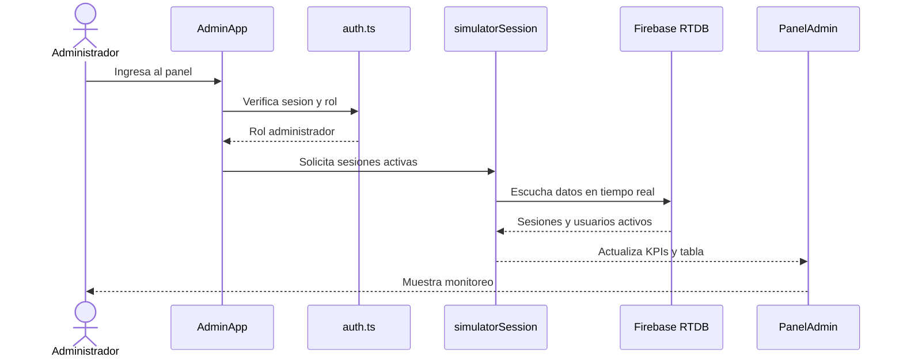

#### Caso de Uso 10: Gestionar roles

| Campo | Descripcion |
|---|---|
| Actor | Administrador |
| Precondicion | Usuario administrador autenticado y Firebase configurado. |
| Flujo principal | Selecciona usuario, cambia rol y confirma actualizacion. |
| Flujo alterno | Si no tiene permisos, se bloquea la operacion. |
| Postcondicion | El usuario seleccionado queda con el rol actualizado. |

**Diagrama de secuencia**

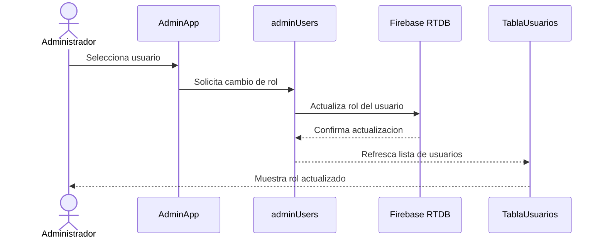

## 3. Modelo Logico

### a) Analisis de Objetos

| Objeto | Responsabilidad |
|---|---|
| `EngineTab` | Representa una pestana de trabajo por motor. |
| `QueryPane` | Representa un panel de consulta dentro de una pestana. |
| `QueryResult` | Contiene columnas, filas, tiempos y sets de resultado. |
| `SimulationSettings` | Define latencia, errores, conexiones y aislamiento. |
| `LoadMetrics` | Contiene usuarios, TPS, CPU, latencia y errores. |
| `ManagedUser` | Representa usuario administrable. |
| `SimulatorSession` | Representa actividad publicada por el simulador. |
| `SchemaEntry` | Guarda metadatos de esquema importado. |

### b) Diagrama de Actividades con Objetos

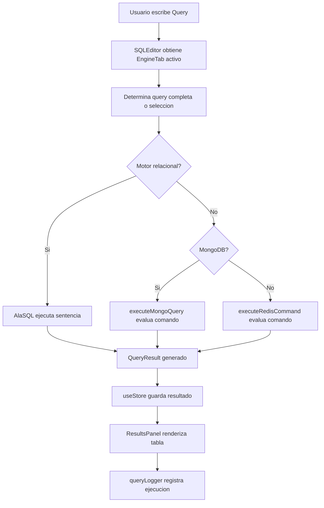

### b.1) Diagrama de Flujo de Datos

```mermaid
flowchart LR
    Usuario((Usuario))
    Admin((Administrador))
    Importacion["Importacion de archivos"]
    Editor["Editor de consultas"]
    Motor["Motor de ejecucion simulado"]
    Resultados["Panel de resultados"]
    Exportador["Exportador de evidencias"]
    IDB[("IndexedDB")]
    Firebase[("Firebase RTDB/Auth")]
    Historial[("Historial local")]

    Usuario --> Importacion
    Importacion --> IDB
    Usuario --> Editor
    Editor --> Motor
    Motor --> Resultados
    Motor --> IDB
    Resultados --> Exportador
    Exportador --> Usuario
    Motor --> Historial
    Admin --> Firebase
    Firebase --> Admin
```

### c) Diagrama de Secuencia General

```mermaid
sequenceDiagram
    actor Usuario
    participant Editor as SQLEditor
    participant Store as useStore
    participant Engine as sqlEngine
    participant Runtime as AlaSQL / Simuladores
    participant IDB as IndexedDB
    participant Results as ResultsPanel

    Usuario->>Editor: Ejecutar consulta
    Editor->>Store: Leer tab activo
    Editor->>Engine: Ejecutar segun motor
    Engine->>Runtime: Procesar consulta/comando
    Runtime-->>Engine: Datos resultantes
    Engine->>IDB: Persistir si hay cambios
    Engine-->>Editor: QueryResult
    Editor->>Store: Guardar resultado
    Store->>Results: Notificar cambios
    Results-->>Usuario: Mostrar tabla
```

### d) Diagrama de Clases

```mermaid
classDiagram
    class EngineTab {
        +string id
        +EngineType engine
        +string database
        +string query
        +QueryResult results
    }

    class QueryPane {
        +string id
        +string query
        +QueryResult results
    }

    class QueryResult {
        +string[] columns
        +object[] rows
        +number rowCount
        +number executionTime
    }

    class SimulationSettings {
        +number networkLatency
        +number connectionLimit
        +boolean simulateErrors
        +number errorProbability
    }

    class Store {
        +EngineTab[] tabs
        +addTab()
        +setTabResults()
        +registerDatabase()
    }

    class SqlEngine {
        +executeSQL()
        +executeMongoQuery()
        +executeRedisCommand()
        +importTableFromSQL()
    }

    class IndexedDbStorage {
        +idbSaveTables()
        +idbLoadTables()
        +idbSaveSchema()
    }

    EngineTab "1" o-- "*" QueryPane
    EngineTab --> QueryResult
    Store --> EngineTab
    Store --> SimulationSettings
    SqlEngine --> QueryResult
    SqlEngine --> IndexedDbStorage
```

## 4. Artefactos de requisitos complementarios

### a) Diagrama Entidad-Relacion Preliminar

```mermaid
erDiagram
    USUARIO ||--o{ ENGINE_TAB : crea
    ENGINE_TAB ||--o{ QUERY_PANE : contiene
    ENGINE_TAB ||--o{ QUERY_RESULT : genera
    ENGINE_TAB ||--o{ SCHEMA_ENTRY : registra
    USUARIO ||--o{ QUERY_HISTORY : conserva
    USUARIO ||--o{ SIMULATOR_SESSION : publica
    SIMULATOR_SESSION ||--o{ LOAD_METRIC : produce

    USUARIO {
        string id
        string email
        string role
    }

    ENGINE_TAB {
        string id
        string engine
        string database
    }

    QUERY_PANE {
        string id
        string query
    }

    QUERY_RESULT {
        string id
        int rowCount
        int executionTime
    }

    SCHEMA_ENTRY {
        string dbName
        string tableName
        string columns
    }

    QUERY_HISTORY {
        string id
        string query
        string executedAt
    }

    SIMULATOR_SESSION {
        string id
        string engine
        string status
    }

    LOAD_METRIC {
        string id
        float tps
        float latency
        float errorRate
    }
```

### b) Diagrama de Estados

```mermaid
stateDiagram-v2
    [*] --> NoAutenticado
    NoAutenticado --> Autenticado: login correcto
    NoAutenticado --> NoAutenticado: credenciales invalidas
    Autenticado --> IDEListo: cargar aplicacion
    IDEListo --> EditandoConsulta: seleccionar motor
    EditandoConsulta --> EjecutandoConsulta: ejecutar
    EjecutandoConsulta --> MostrandoResultados: exito
    EjecutandoConsulta --> MostrandoError: error
    MostrandoResultados --> Exportando: exportar evidencia
    MostrandoResultados --> EditandoConsulta: nueva consulta
    MostrandoError --> EditandoConsulta: corregir consulta
    Exportando --> IDEListo: descarga generada
    Autenticado --> Cerrado: cerrar sesion
    Cerrado --> [*]
```

### c) Matriz de Trazabilidad de Requisitos

| Requisito | Caso de uso relacionado | Modulo | Evidencia / diagrama |
|---|---|---|---|
| RF001 Autenticacion | Iniciar sesion | `LoginScreen`, `auth.ts` | Secuencia CU1 |
| RF002 Editor Monaco | Ejecutar consultas | `SQLEditor` | Secuencia CU2 |
| RF003 Tabs por motor | Ejecutar consultas | `EngineTabs`, `useStore` | Casos de uso general |
| RF004 SQL relacional | Ejecutar consultas | `sqlEngine.ts` | DFD, secuencia general |
| RF006 MongoDB simulado | Ejecutar consultas | `executeMongoQuery` | Secuencia CU2 |
| RF007 Redis simulado | Ejecutar consultas | `executeRedisCommand` | Secuencia CU2 |
| RF008 Importar CSV | Importar datos | `ImportModal`, `importTableFromCSV` | Secuencia CU3 |
| RF009 Importar JSON | Importar datos | `ImportModal`, `importTableFromJSON` | Secuencia CU3 |
| RF010 Importar SQL | Importar datos | `ImportModal`, `importTableFromSQL` | Secuencia CU3 |
| RF011 Persistencia local | Importar datos / Explorar esquema | `idbStorage.ts` | ER preliminar, DFD |
| RF013 Exportacion | Exportar resultados | `ExportModal`, `exportHelper` | Secuencia CU4 |
| RF014 Explorador de esquema | Explorar esquema | `SchemaExplorer` | Secuencia CU5 |
| RF015 Historial y logs | Ver historial | `HistoryModal`, `queryLogger` | Secuencia CU8 |
| RF017 Simulador de carga | Simular carga | `LoadSimulatorModal` | Secuencia CU6 |
| RF018 Comparacion de motores | Comparar motores | `LoadSimulatorModal` | Secuencia CU7 |
| RF020 Panel admin | Monitorear sesiones | `AdminApp` | Secuencia CU9 |
| RF021 Presencia | Monitorear sesiones | `presence.ts`, Firebase | Secuencia CU9 |
| RF022 Desktop | Uso general | Electron | Diagrama de contexto |

### d) Prototipos o Wireframes de Pantallas Principales

#### Pantalla principal del IDE

```mermaid
flowchart TB
    Top["Barra superior: ejecutar / importar / exportar / ayuda"]
    Side["Sidebar: esquema / historial / configuracion"]
    Tabs["Tabs por motor"]
    Editor["Editor Monaco SQL/NoSQL"]
    Results["Panel de resultados"]

    Top --> Tabs
    Tabs --> Editor
    Side --> Editor
    Editor --> Results
```

#### Modal de importacion y exportacion

```mermaid
flowchart TB
    Modal["Modal"]
    Tipo["Seleccion de tipo: SQL / CSV / JSON / Resultado"]
    Archivo["Selector de archivo o formato"]
    Validacion["Validacion"]
    Confirmar["Confirmar accion"]

    Modal --> Tipo --> Archivo --> Validacion --> Confirmar
```

#### Panel administrativo

```mermaid
flowchart TB
    Login["Login administrador"]
    KPIs["KPIs: usuarios, sesiones, TPS, motores"]
    Tabla["Tabla de usuarios y sesiones"]
    Roles["Gestion de roles"]

    Login --> KPIs
    KPIs --> Tabla
    Tabla --> Roles
```

---

# CONCLUSIONES

1. El sistema cubre los requerimientos principales para un simulador academico de bases de datos.
2. La solucion reduce la necesidad de instalar motores reales para practicas iniciales.
3. La arquitectura modular permite mantener y extender motores, exportadores y componentes.
4. La persistencia local, el historial y las exportaciones facilitan la generacion de evidencias.
5. El simulador de carga complementa el aprendizaje con metricas didacticas de rendimiento.

---

# RECOMENDACIONES

1. Corregir textos con problemas de codificacion en la interfaz y documentacion.
2. Agregar pruebas automatizadas para `sqlEngine`, importadores y exportadores.
3. Documentar ejemplos por motor para estudiantes.
4. Mantener diferenciada la simulacion respecto a una conexion real.
5. Evaluar una version futura con conectores reales opcionales.

---

# REFERENCIAS BIBLIOGRAFICAS

- Sommerville, I. (2016). *Software Engineering*.
- Pressman, R. S., & Maxim, B. R. (2020). *Software Engineering: A Practitioner's Approach*.
- Silberschatz, A., Korth, H. F., & Sudarshan, S. (2019). *Database System Concepts*.
- Elmasri, R., & Navathe, S. B. (2016). *Fundamentals of Database Systems*.
- React Documentation: https://react.dev/
- TypeScript Documentation: https://www.typescriptlang.org/docs/
- Vite Documentation: https://vitejs.dev/
- Firebase Documentation: https://firebase.google.com/docs
