# UNIVERSIDAD PRIVADA DE TACNA

## FACULTAD DE INGENIERIA

### Escuela Profesional de Ingenieria de Sistemas

---

# Proyecto: Simulador de Bases de Datos

**Curso:** Calidad y Pruebas de Software

**Docente:** MAG. Patrick Cuadros Quiroga

**Integrantes:**

- Jhony Vargas Luque (2022075754)
- Abel Fernando Pacompia Ortiz (2023076797)

**Tacna - Peru**

**2026**

---

## CONTROL DE VERSIONES

| Version | Hecha por | Revisada por | Aprobada por | Fecha | Motivo |
|---|---|---|---|---|---|
| 1.0 | APO, JVL | APO, JVL | P. Cuadros Q. | 2026-04-25 | Version inicial |
| 2.0 | APO, JVL | APO, JVL | P. Cuadros Q. | 2026-06-21 | Adaptacion a la implementacion final |
| 2.1 | APO, JVL | APO, JVL | P. Cuadros Q. | 2026-07-04 | Actualizacion con rutas, CI/CD y workflows actuales |

---

# Sistema Simulador de Bases de Datos

## Documento de Arquitectura de Software

**Version 2.1**

---

## INDICE GENERAL

I. [INTRODUCCION](#i-introduccion)
   A. [Proposito](#a-proposito-diagrama-41)
   B. [Alcance](#b-alcance)
   C. [Definicion, siglas y abreviaturas](#c-definicion-siglas-y-abreviaturas)
   D. [Referencias](#d-referencias)
II. [Representacion Arquitectonica](#ii-representacion-arquitectonica)
   - [Diagrama de arquitectura general](#diagrama-de-arquitectura-general)
   A. [Vista Escenarios](#a-vista-escenarios)
      - [Diagrama C4 de contexto](#diagrama-c4-de-contexto)
   B. [Vista Logica](#b-vista-logica)
   C. [Vista del Proceso](#c-vista-del-proceso)
      - [Diagrama de Actividades del Sistema](#diagrama-de-actividades-del-sistema)
      - [Diagrama de flujo tecnico](#diagrama-de-flujo-tecnico)
   D. [Vista del desarrollo](#d-vista-del-desarrollo)
      - [Diagrama de Capas del Sistema Web](#diagrama-de-capas-del-sistema-web)
      - [Diagrama de Capas del Sistema Desktop](#diagrama-de-capas-del-sistema-desktop)
      - [Diagrama de paquetes o modulos](#diagrama-de-paquetes-o-modulos)
   E. [Vista Fisica](#e-vista-fisica)
      - [Diagrama C4 de contenedores](#diagrama-c4-de-contenedores)
      - [Diagrama de integracion con servicios externos](#diagrama-de-integracion-con-servicios-externos)
III. [Objetivos y limitaciones arquitectonicas](#iii-objetivos-y-limitaciones-arquitectonicas)
   A. [Disponibilidad](#a-disponibilidad)
   B. [Seguridad](#b-seguridad)
      - [Diagrama de seguridad](#diagrama-de-seguridad)
IV. [Analisis de Requerimientos](#iv-analisis-de-requerimientos)
   4.1 [Priorizacion de requerimientos](#41-priorizacion-de-requerimientos)
      A. [Requerimientos funcionales](#a-requerimientos-funcionales)
      B. [Requerimientos no funcionales](#b-requerimientos-no-funcionales)
V. [Vistas de Caso de Uso](#v-vistas-de-caso-de-uso)
   [Diagrama de Caso de Uso](#diagrama-de-caso-de-uso)
VI. [Vista Logica](#vi-vista-logica)
   A. [Diagrama Contextual](#a-diagrama-contextual)
VII. [Vista de Procesos](#vii-vista-de-procesos)
   A. [Diagrama de Proceso Actual](#a-diagrama-de-proceso-actual)
   B. [Diagrama de Proceso Propuesto](#b-diagrama-de-proceso-propuesto)
VIII. [Vista de Despliegue](#viii-vista-de-despliegue)
   A. [Diagrama de Contenedor](#a-diagrama-de-contenedor)
IX. [Vista de Implementacion](#ix-vista-de-implementacion)
   A. [Diagrama de Componentes - Sistema Web](#a-diagrama-de-componentes---sistema-web)
   B. [Diagrama de Componentes - Sistema Desktop](#b-diagrama-de-componentes---sistema-desktop)
X. [Vista de Datos](#x-vista-de-datos)
   A. [Diagrama Entidad Relacion](#a-diagrama-entidad-relacion)
XI. [Calidad](#xi-calidad)
   A. [Escenario de Seguridad](#a-escenario-de-seguridad)
   B. [Escenario de Usabilidad](#b-escenario-de-usabilidad)
   C. [Escenario de Adaptabilidad](#c-escenario-de-adaptabilidad)
   D. [Escenario de Disponibilidad](#d-escenario-de-disponibilidad)
   E. [Escenario de Escalabilidad](#e-escenario-de-escalabilidad)

---

# I. INTRODUCCION

## A. Proposito (Diagrama 4+1)

Este documento describe la arquitectura del **Simulador de Bases de Datos**, una aplicacion web y desktop desarrollada con React, TypeScript, Vite, AlaSQL, IndexedDB, Firebase y Electron.

La arquitectura se presenta con un enfoque inspirado en el modelo **4+1 vistas**, considerando:

- Vista de casos de uso.
- Vista logica.
- Vista de implementacion.
- Vista de procesos.
- Vista de despliegue.

El objetivo es mostrar como se organizan los componentes, como interactuan entre si y que decisiones tecnicas sostienen los atributos de calidad del sistema.

## B. Alcance

El documento cubre:

- Componentes frontend React.
- Estado global con Zustand.
- Motores simulados SQL, MongoDB y Redis.
- Persistencia local con IndexedDB y LocalStorage.
- Servicios Firebase para autenticacion, presencia, sesiones y roles.
- Simulador de carga.
- Panel administrativo.
- Empaquetado desktop con Electron.
- Workflows de GitHub Actions para rendimiento y despliegue.
- Diagramas PlantUML de arquitectura, procesos y despliegue.

No cubre una arquitectura de conexion a motores reales, porque la version actual ejecuta consultas de forma local y simulada.

## C. Definicion, siglas y abreviaturas

| Termino | Definicion |
|---|---|
| IDE | Entorno integrado para escribir y ejecutar consultas. |
| SQL | Lenguaje estructurado para bases de datos relacionales. |
| NoSQL | Modelos de datos no relacionales, como documentos o clave-valor. |
| AlaSQL | Motor SQL en memoria usado en el navegador. |
| IndexedDB | Base de datos local del navegador. |
| Zustand | Libreria de estado global para React. |
| Firebase Auth | Servicio de autenticacion. |
| RTDB | Firebase Realtime Database. |
| Electron | Plataforma para empaquetar aplicaciones web como desktop. |
| TPS | Transacciones o consultas por segundo, estimadas en el simulador. |
| CI/CD | Integracion y despliegue continuo mediante GitHub Actions. |

## D. Referencias

- FD01-EPIS. Informe de Factibilidad del Proyecto Simulador de Bases de Datos. Universidad Privada de Tacna, 2026.
- FD02-EPIS. Informe Vision del Proyecto Simulador de Bases de Datos. Universidad Privada de Tacna, 2026.
- FD03-EPIS. Informe SRS del Proyecto Simulador de Bases de Datos. Universidad Privada de Tacna, 2026.
- React Documentation: https://react.dev/
- TypeScript Documentation: https://www.typescriptlang.org/docs/
- Vite Documentation: https://vitejs.dev/
- Firebase Documentation: https://firebase.google.com/docs
- Electron Documentation: https://www.electronjs.org/docs/latest/

# II. REPRESENTACION ARQUITECTONICA

### Diagrama de arquitectura general

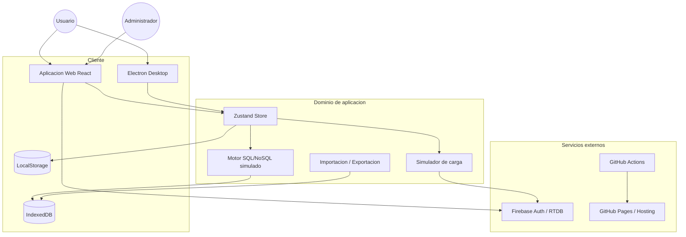

## A. Vista Escenarios

### Diagrama C4 de contexto

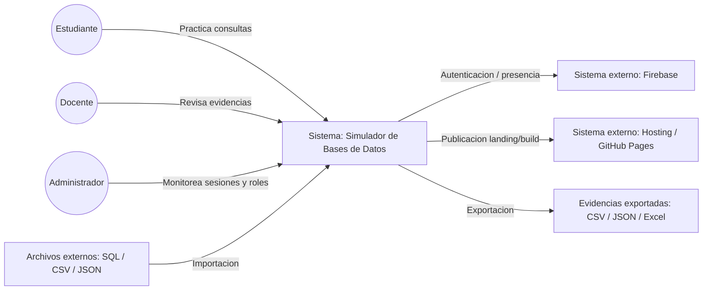

### Diagrama de Caso de Uso

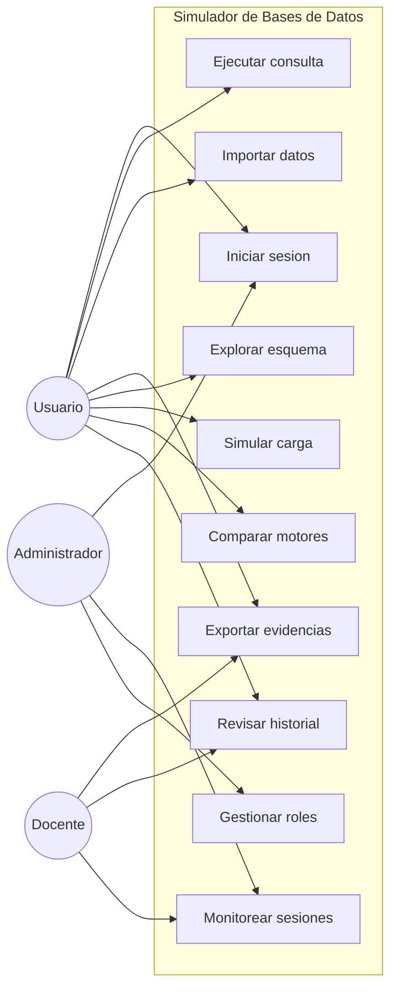

## B. Vista Logica

### Diagrama de subsistemas

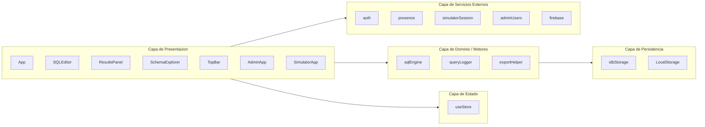

### Diagrama de secuencia general

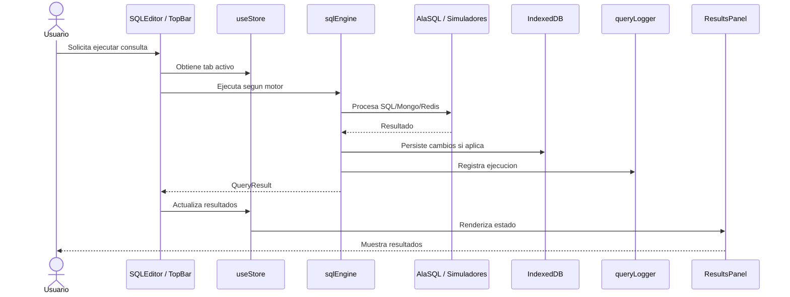

### Diagrama de colaboracion

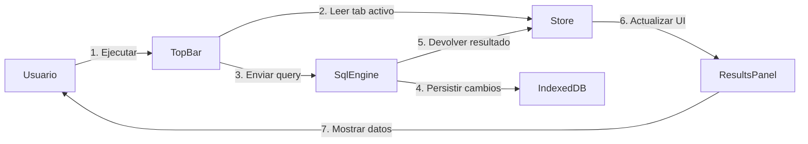

### Diagrama de objetos

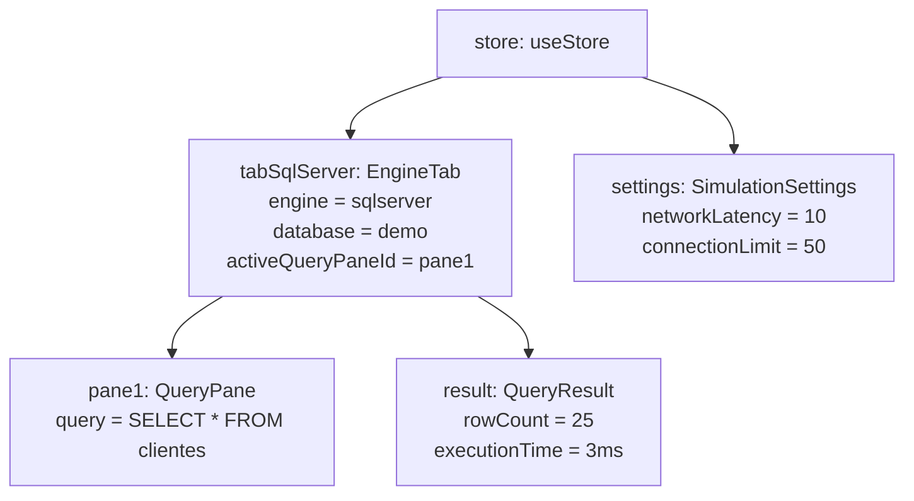

### Diagrama de clases

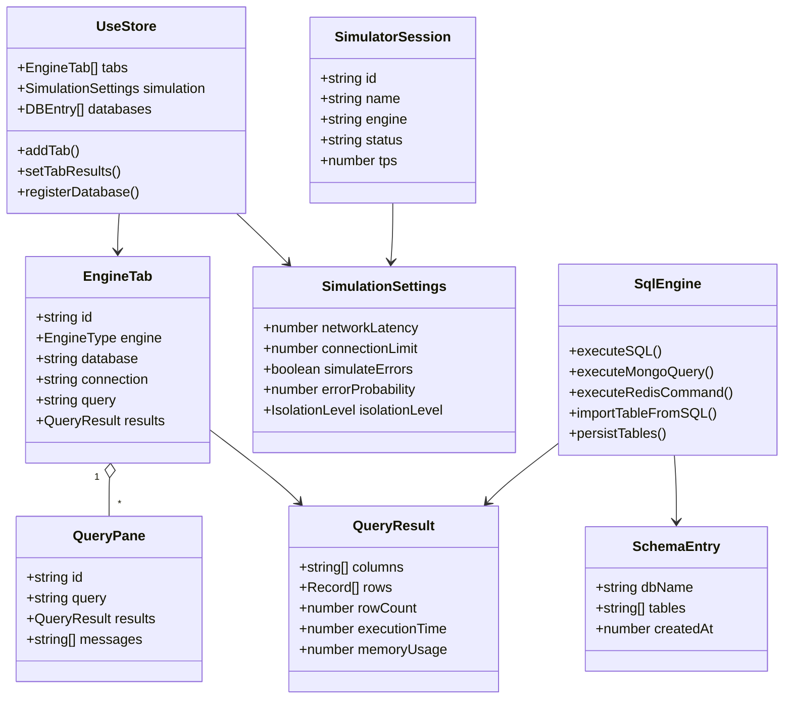

### Diagrama de datos y persistencia

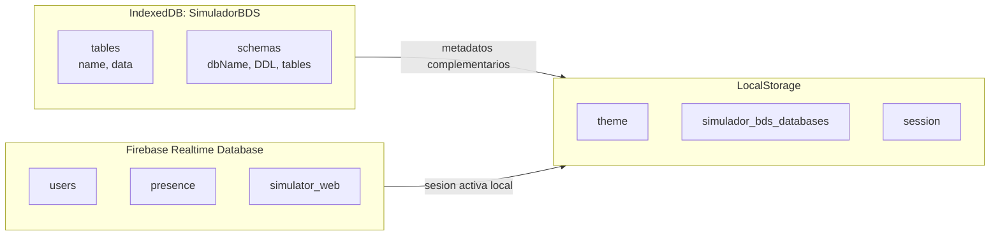

## C. Vista del Proceso

### Diagrama de Actividades del Sistema

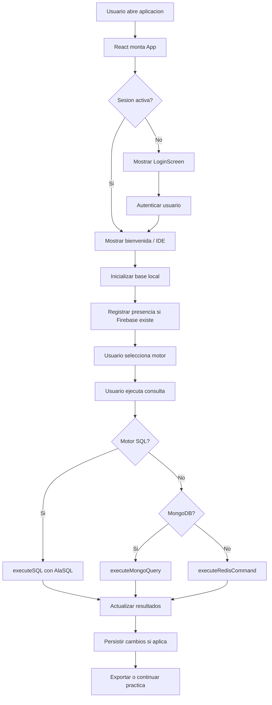

### Diagrama de flujo tecnico

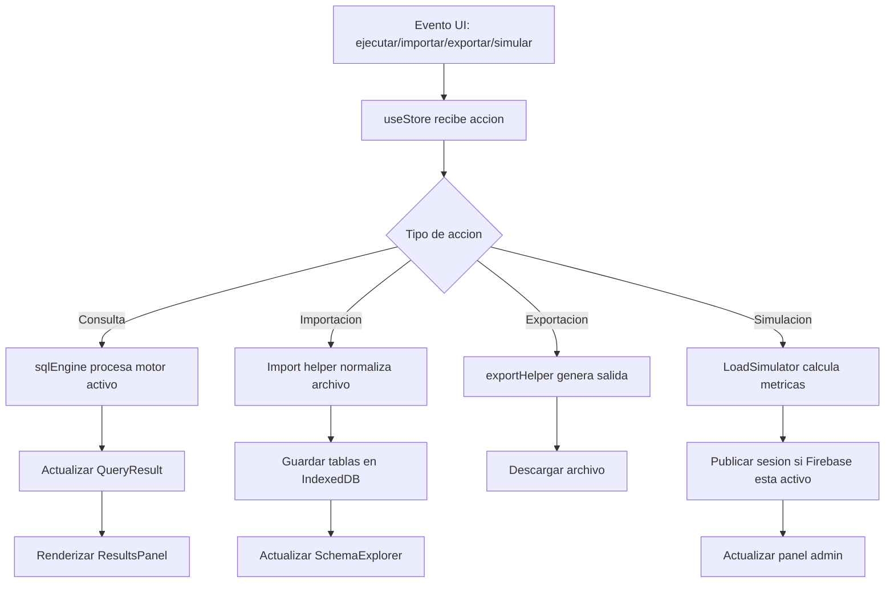

## D. Vista del desarrollo

### Diagrama de Capas del Sistema Web

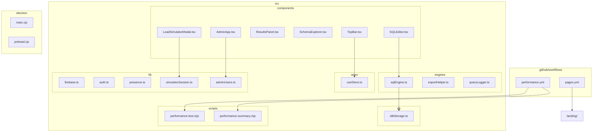

### Diagrama de Capas del Sistema Desktop

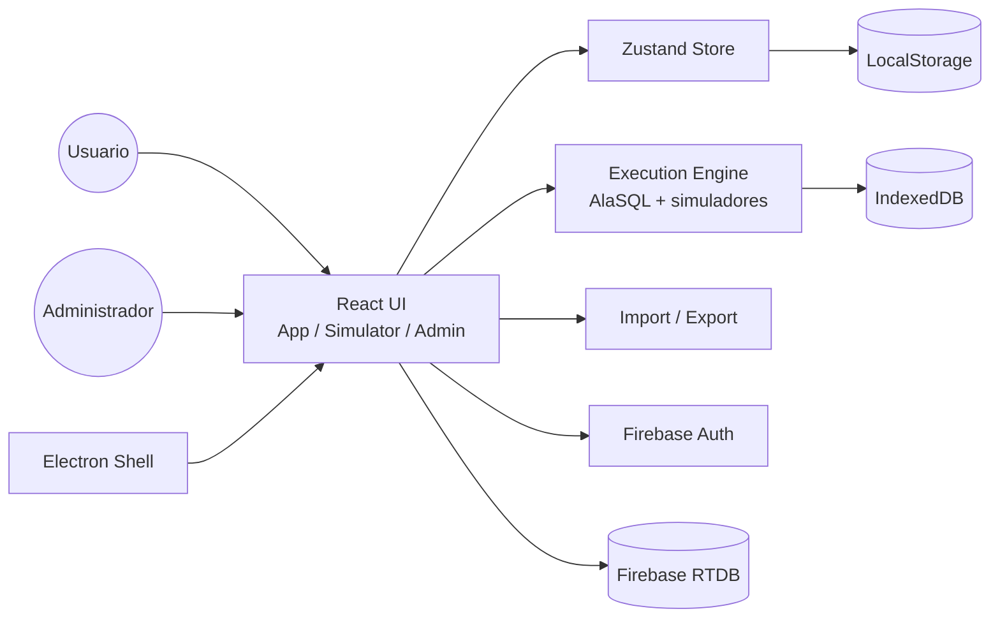

### Diagrama de paquetes o modulos

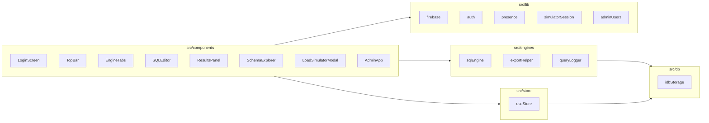

## E. Vista Fisica

### Diagrama C4 de contenedores

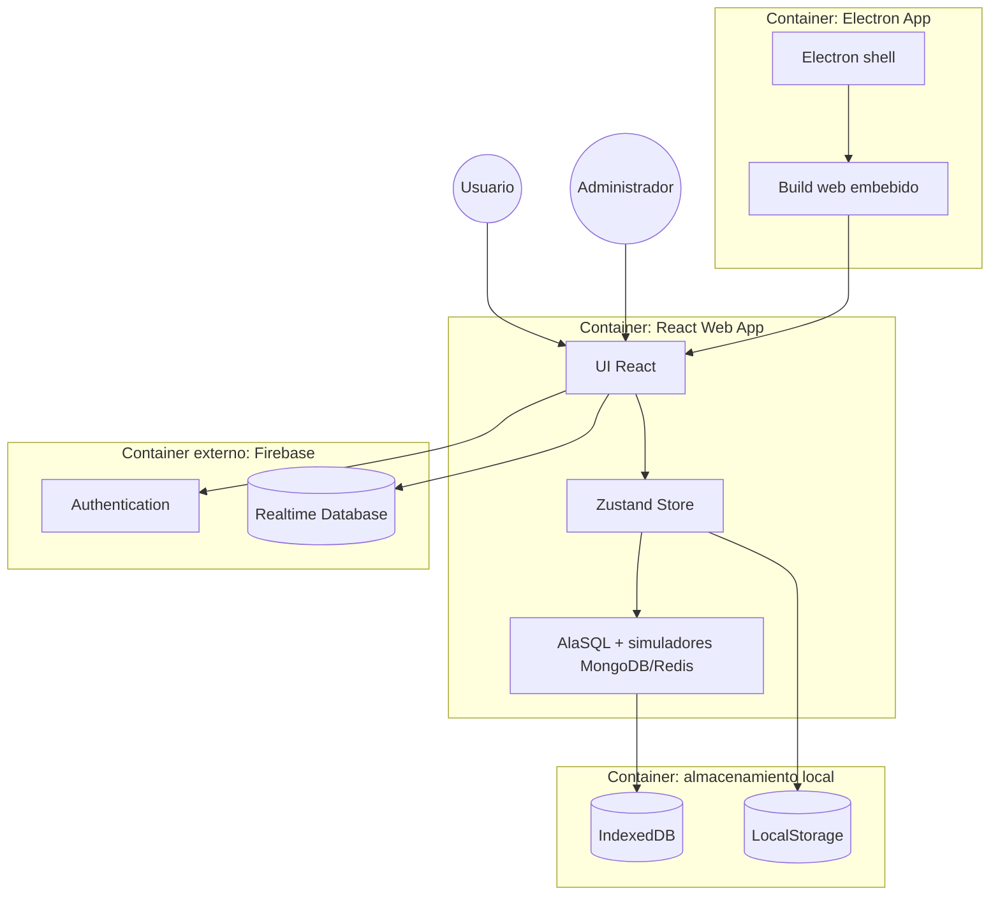

### Diagrama de Contenedor

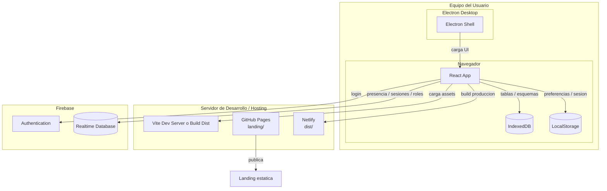

### Diagrama de integracion con servicios externos

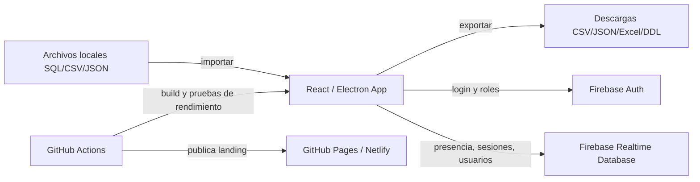

**Escalabilidad:**

- La ejecucion de consultas ocurre en el cliente, reduciendo carga de servidor.
- Firebase escala las funciones de presencia y sesiones.
- El build estatico puede desplegarse en Netlify, Firebase Hosting u otro hosting.
- La landing se despliega automaticamente en GitHub Pages desde `landing/`.
- GitHub Actions ejecuta build y pruebas de rendimiento antes de integrar cambios.

**Disponibilidad:**

- La aplicacion puede funcionar localmente para operaciones que no requieren Firebase.
- La persistencia IndexedDB permite conservar datos entre sesiones del mismo navegador.
- Las funciones admin dependen de disponibilidad de Firebase.

---

# III. OBJETIVOS Y LIMITACIONES ARQUITECTONICAS

## A. Disponibilidad

El IDE puede operar parcialmente sin Firebase para consultas locales, importacion, exportacion y persistencia en IndexedDB. Las funciones de login, presencia y administracion dependen de la disponibilidad de Firebase.

## B. Seguridad

La arquitectura separa las funciones administrativas mediante autenticacion y roles. Las credenciales y variables de entorno de Firebase deben mantenerse fuera del repositorio publico.

### Diagrama de seguridad

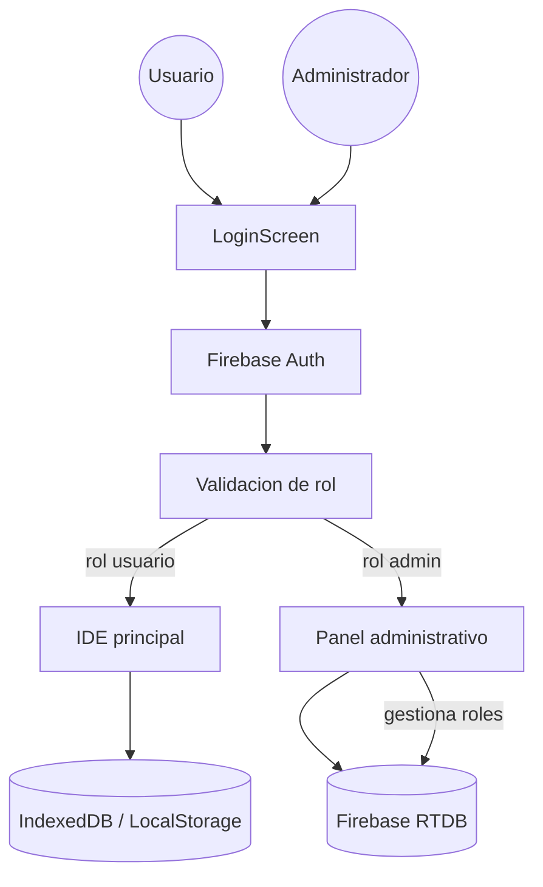

## Restricciones Tecnicas

- La ejecucion SQL depende de AlaSQL.
- IndexedDB depende del navegador.
- Firebase requiere variables de entorno configuradas.
- Electron depende del sistema operativo objetivo.
- MongoDB y Redis son simulaciones, no servidores reales.

## Restricciones Operacionales

- El usuario debe ejecutar `npm install` y `npm run dev` para desarrollo.
- Los datos locales pueden perderse si el navegador limpia IndexedDB.
- Las funciones admin requieren conexion y configuracion Firebase.
- El rendimiento de consultas depende del equipo cliente.

## Restricciones del Negocio

- El sistema es academico y no reemplaza motores reales.
- Las metricas de carga son didacticas.
- No debe presentarse como benchmark real de bases de datos.

---

# IV. ANALISIS DE REQUERIMIENTOS

## 4.1 Priorizacion de requerimientos

### A. Requerimientos funcionales

| ID | Requerimiento Arquitectonico |
|---|---|
| RF-A01 | Ejecutar consultas SQL en memoria mediante un motor local. |
| RF-A02 | Simular operaciones MongoDB y Redis. |
| RF-A03 | Persistir tablas y esquemas en IndexedDB. |
| RF-A04 | Gestionar estado de tabs, consultas, resultados y simulacion. |
| RF-A05 | Importar archivos SQL, CSV y JSON. |
| RF-A06 | Exportar resultados y esquemas en multiples formatos. |
| RF-A07 | Simular carga con metricas de TPS, latencia, CPU, conexiones y errores. |
| RF-A08 | Registrar presencia y sesiones cuando Firebase esta configurado. |
| RF-A09 | Permitir panel administrativo con roles. |
| RF-A10 | Construir version web y desktop. |
| RF-A11 | Automatizar pruebas de rendimiento y despliegue de landing. |

### B. Requerimientos no funcionales

| ID | Atributo | Decisiones Arquitectonicas |
|---|---|---|
| RNF-A01 | Usabilidad | Layout tipo IDE, Monaco Editor, modales y acciones visibles. |
| RNF-A02 | Rendimiento | Ejecucion local en memoria e IndexedDB para persistencia. |
| RNF-A03 | Mantenibilidad | Separacion por componentes, motores, store, librerias y servicios. |
| RNF-A04 | Portabilidad | Vite para web y Electron para desktop. |
| RNF-A05 | Auditabilidad | Historial, logs, exportaciones y sesiones de simulador. |
| RNF-A06 | Seguridad | Firebase Auth y roles para administracion. |
| RNF-A07 | Extensibilidad | Configuracion central de motores y exportadores por modulo. |
| RNF-A08 | Integracion continua | GitHub Actions valida build, rendimiento y despliegue. |

---

# V. VISTAS DE CASO DE USO

El diagrama de caso de uso resume las interacciones principales de Usuario, Docente y Administrador con el simulador.

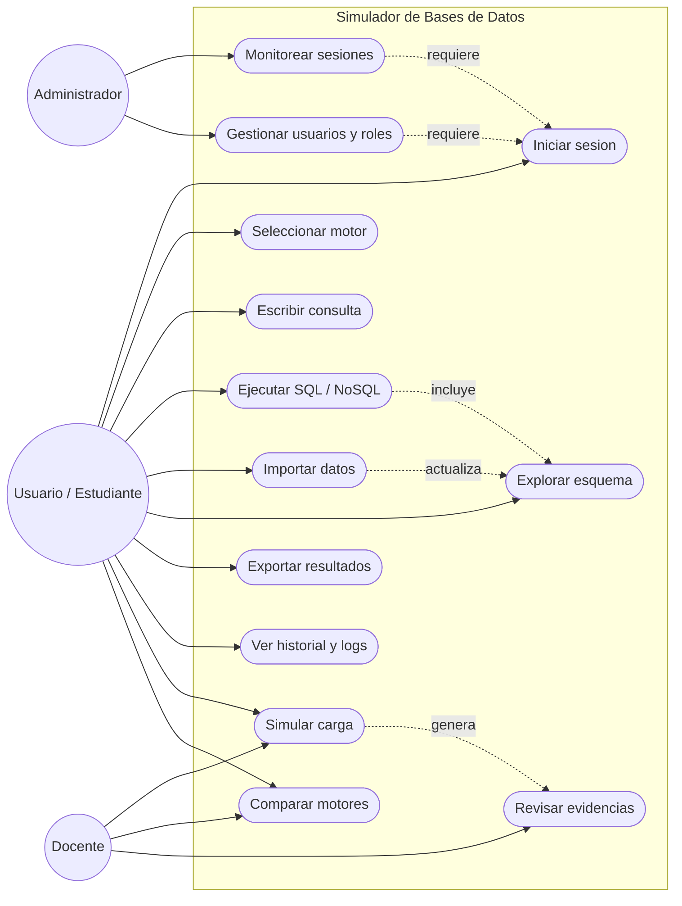

# VI. VISTA LOGICA

## A. Diagrama Contextual

El diagrama contextual muestra los subsistemas logicos internos y sus dependencias principales.

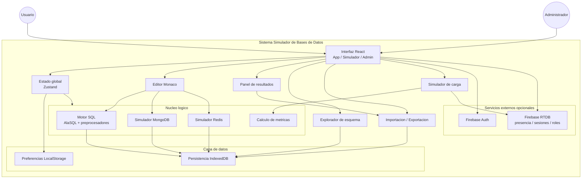

# VII. VISTA DE PROCESOS

## A. Diagrama de Proceso Actual

El proceso actual corresponde a la practica tradicional con instalacion de motores reales, configuracion manual y uso de herramientas separadas por tecnologia.

```mermaid
flowchart TD
    A["Inicio de practica de bases de datos"] --> B["Elegir motor requerido"]
    B --> C["Buscar instalador / servicio"]
    C --> D["Instalar motor local"]
    D --> E["Configurar puertos, usuarios y credenciales"]
    E --> F{"Configuracion correcta?"}
    F -->|No| G["Corregir errores de instalacion"]
    G --> E
    F -->|Si| H["Instalar cliente o herramienta externa"]
    H --> I["Crear base de datos y tablas"]
    I --> J["Cargar datos de prueba"]
    J --> K["Ejecutar consultas"]
    K --> L{"Se requiere otro motor?"}
    L -->|Si| B
    L -->|No| M["Exportar evidencias manualmente"]
    M --> N["Fin de practica"]
```

## B. Diagrama de Proceso Propuesto

El proceso propuesto permite que el usuario acceda al simulador, seleccione motor, ejecute consultas, revise resultados y exporte evidencias desde un solo entorno.

```mermaid
flowchart TD
    A["Inicio de practica"] --> B["Abrir aplicacion web o desktop"]
    B --> C["Iniciar sesion si corresponde"]
    C --> D["Seleccionar motor simulado"]
    D --> E{"Tipo de entrada"}
    E -->|Consulta manual| F["Escribir consulta en Monaco Editor"]
    E -->|Archivo| G["Importar SQL, CSV o JSON"]
    G --> H["Guardar tablas y esquemas en IndexedDB"]
    F --> I["Ejecutar consulta"]
    H --> I
    I --> J{"Motor seleccionado"}
    J -->|SQL| K["Procesar con AlaSQL"]
    J -->|MongoDB| L["Ejecutar simulador MongoDB"]
    J -->|Redis| M["Ejecutar simulador Redis"]
    K --> N["Mostrar resultados"]
    L --> N
    M --> N
    N --> O["Actualizar esquema, historial y logs"]
    O --> P{"Requiere simulacion de carga?"}
    P -->|Si| Q["Configurar usuarios, duracion y motor"]
    Q --> R["Calcular TPS, latencia, CPU y errores"]
    R --> S["Generar reporte de simulacion"]
    P -->|No| T["Exportar resultados o base"]
    S --> T
    T --> U["Fin de practica"]
```

# VIII. VISTA DE DESPLIEGUE

## A. Diagrama de Contenedor

El diagrama de contenedor presenta la distribucion fisica y logica del sistema en navegador, escritorio, almacenamiento local, servicios externos y automatizacion.

```mermaid
flowchart TB
    Usuario((Usuario))
    Admin((Administrador))
    Dev((Desarrollador))

    subgraph Client["Dispositivo del usuario"]
        Browser["Navegador moderno"]
        Electron["Aplicacion Electron"]
        IDB[("IndexedDB<br/>tablas y esquemas")]
        LS[("LocalStorage<br/>preferencias e historial")]
    end

    subgraph StaticHosting["Hosting estatico"]
        Landing["Landing page"]
        WebApp["Build Vite<br/>app.html / simulator.html / admin.html"]
    end

    subgraph AppContainer["Contenedor de aplicacion"]
        React["React UI"]
        Store["Zustand Store"]
        Engine["AlaSQL + simuladores<br/>MongoDB / Redis"]
        Exporter["Exportadores<br/>CSV / JSON / Excel / SQL"]
    end

    subgraph FirebaseCloud["Firebase"]
        Auth["Firebase Auth"]
        RTDB[("Realtime Database<br/>presencia / sesiones / roles")]
    end

    subgraph CI["GitHub Actions"]
        Build["Build y validacion"]
        Performance["Pruebas de rendimiento"]
        Pages["Deploy landing"]
    end

    Usuario --> Browser
    Usuario --> Electron
    Admin --> Browser
    Browser --> WebApp
    Electron --> WebApp
    WebApp --> React
    React --> Store
    Store --> Engine
    Engine --> IDB
    React --> LS
    React --> Exporter
    React --> Auth
    React --> RTDB
    Dev --> CI
    CI --> Build
    CI --> Performance
    CI --> Pages
    Pages --> Landing
    Build --> WebApp
```

# IX. VISTA DE IMPLEMENTACION

## A. Diagrama de Componentes - Sistema Web

El sistema web se organiza en componentes React, store Zustand, motores simulados, persistencia local, servicios Firebase, scripts de rendimiento y workflows de GitHub Actions.

```mermaid
flowchart TB
    Usuario((Usuario))
    Admin((Administrador))

    subgraph Web["Sistema Web React"]
        App["App.tsx"]
        AdminApp["AdminApp.tsx"]
        SimulatorView["Vista simulador<br/>simulator.html"]

        subgraph UI["Componentes de interfaz"]
            Login["LoginScreen"]
            TopBar["TopBar"]
            EngineTabs["EngineTabs"]
            Editor["SQLEditor"]
            Results["ResultsPanel"]
            Schema["SchemaExplorer"]
            ImportExport["DatabaseManagerModal / ExportModal"]
            LoadSimulator["LoadSimulatorModal"]
            History["HistoryModal"]
            Settings["SettingsModal / EnvModal"]
        end

        Store["useStore<br/>Estado global Zustand"]

        subgraph Engines["Motores simulados"]
            SQLEngine["sqlEngine.ts<br/>AlaSQL + preprocesadores"]
            MongoEngine["executeMongoQuery"]
            RedisEngine["executeRedisCommand"]
            ExportHelper["exportHelper.ts"]
        end

        subgraph Persistence["Persistencia local"]
            IDBStorage["idbStorage.ts"]
            QueryLogger["Historial y logs locales"]
            LocalSettings["localStorage"]
        end

        subgraph FirebaseServices["Servicios Firebase"]
            Auth["auth.ts"]
            Presence["presence.ts"]
            SimulatorSession["simulatorSession.ts"]
            Roles["Gestion de roles / usuarios"]
        end

        subgraph Automation["Automatizacion"]
            PerfScript["performance-test.mjs"]
            SummaryScript["performance-summary.mjs"]
            WorkflowPerf["performance.yml"]
            WorkflowPages["pages.yml"]
        end
    end

    IDB[("IndexedDB")]
    BrowserStorage[("LocalStorage")]
    Firebase[("Firebase Auth / RTDB")]
    GitHub["GitHub Actions"]

    Usuario --> App
    Usuario --> SimulatorView
    Admin --> AdminApp

    App --> UI
    SimulatorView --> LoadSimulator
    AdminApp --> FirebaseServices
    UI --> Store
    Store --> Engines
    Store --> Persistence
    Editor --> SQLEngine
    ImportExport --> SQLEngine
    Results --> ExportHelper
    Schema --> IDBStorage
    LoadSimulator --> SQLEngine
    LoadSimulator --> SimulatorSession
    History --> QueryLogger
    Login --> Auth

    IDBStorage --> IDB
    QueryLogger --> BrowserStorage
    LocalSettings --> BrowserStorage
    Auth --> Firebase
    Presence --> Firebase
    SimulatorSession --> Firebase
    Roles --> Firebase
    WorkflowPerf --> PerfScript
    WorkflowPerf --> SummaryScript
    WorkflowPerf --> GitHub
    WorkflowPages --> GitHub
```

## B. Diagrama de Componentes - Sistema Desktop

El sistema desktop usa Electron como contenedor de la aplicacion web, reutilizando la interfaz React y los servicios locales del navegador.

```mermaid
flowchart TB
    Usuario((Usuario Desktop))

    subgraph Desktop["Sistema Desktop Electron"]
        Main["electron/main.cjs<br/>Proceso principal"]
        Window["BrowserWindow<br/>Ventana de escritorio"]
        Menu["Menu / ciclo de vida"]
        Assets["dist/<br/>Build Vite"]

        subgraph Renderer["Proceso renderer"]
            ReactApp["React App"]
            Components["Componentes UI"]
            Store["Zustand Store"]
            Engine["AlaSQL + simuladores<br/>MongoDB / Redis"]
            Exporter["ExportHelper / SheetJS"]
        end

        subgraph LocalData["Datos locales del escritorio"]
            IDBStorage["IndexedDB Storage"]
            LocalStorage["LocalStorage"]
            Files["Archivos exportados<br/>CSV / JSON / Excel / SQL"]
        end

        subgraph OptionalCloud["Servicios opcionales"]
            Auth["Firebase Auth"]
            RTDB["Firebase RTDB<br/>presencia / sesiones / roles"]
        end
    end

    OS["Sistema operativo"]
    Firebase[("Firebase")]

    Usuario --> Window
    Main --> Window
    Main --> Menu
    Window --> Assets
    Assets --> ReactApp
    ReactApp --> Components
    Components --> Store
    Store --> Engine
    Engine --> IDBStorage
    Components --> Exporter
    Exporter --> Files
    Store --> LocalStorage
    ReactApp --> Auth
    ReactApp --> RTDB
    Auth --> Firebase
    RTDB --> Firebase
    Files --> OS
    IDBStorage --> OS
    LocalStorage --> OS
```

# X. VISTA DE DATOS

## A. Diagrama Entidad Relacion

La vista de datos se representa mediante IndexedDB para tablas y esquemas locales, LocalStorage para preferencias y metadatos de sesion, y Firebase Realtime Database para usuarios, presencia y sesiones del simulador.

```mermaid
erDiagram
    USUARIO ||--o{ ENGINE_TAB : crea
    ENGINE_TAB ||--o{ QUERY_PANE : contiene
    ENGINE_TAB ||--o{ QUERY_RESULT : genera
    ENGINE_TAB ||--o{ SCHEMA_ENTRY : registra
    USUARIO ||--o{ QUERY_HISTORY : consulta
    USUARIO ||--o{ SIMULATOR_SESSION : publica
    SIMULATOR_SESSION ||--o{ LOAD_METRIC : produce
    SIMULATION_SETTINGS ||--o{ LOAD_METRIC : configura

    USUARIO {
        string id
        string email
        string role
        string displayName
    }

    ENGINE_TAB {
        string id
        string engine
        string database
        string activeQueryPaneId
    }

    QUERY_PANE {
        string id
        string query
        string engine
    }

    QUERY_RESULT {
        string id
        int rowCount
        int executionTime
        string status
    }

    SCHEMA_ENTRY {
        string dbName
        string tableName
        string columns
    }

    QUERY_HISTORY {
        string id
        string query
        string engine
        string executedAt
    }

    SIMULATION_SETTINGS {
        int networkLatency
        int connectionLimit
        boolean simulateErrors
        float errorProbability
    }

    SIMULATOR_SESSION {
        string id
        string userId
        string engine
        string status
    }

    LOAD_METRIC {
        string id
        int users
        float tps
        float latency
        float errorRate
    }
```

# XI. CALIDAD

## A. Escenario de Seguridad

| Escenario | Descripcion | Implementacion |
|---|---|---|
| ES001 | Acceso administrativo controlado | Firebase Auth y roles para administracion. |
| ES002 | Proteccion de credenciales | Variables de entorno fuera del repositorio publico. |
| ES003 | Separacion de alcance | El simulador no se conecta a motores reales. |

## B. Escenario de Usabilidad

| Escenario | Descripcion | Implementacion |
|---|---|---|
| EU001 | Interfaz tipo IDE | Editor, tabs, sidebar, resultados y esquema. |
| EU002 | Acciones visibles | Barra superior con importar, exportar, ayuda y simulador. |
| EU003 | Aprendizaje guiado | Pantalla de bienvenida, plantillas y ayuda. |
| EU004 | Visualizacion clara | Resultados tabulares, metricas y graficos de carga. |

## C. Escenario de Adaptabilidad

| Escenario | Descripcion | Implementacion |
|---|---|---|
| EA001 | Nuevos motores | Configuracion central de motores y exportadores. |
| EA002 | Web y desktop | Vite para web y Electron para escritorio. |
| EA003 | Servicios opcionales | Firebase se usa cuando existe configuracion disponible. |

## D. Escenario de Disponibilidad

| Escenario | Descripcion | Implementacion |
|---|---|---|
| ED001 | Operacion local | Consultas, importacion y exportacion funcionan sin backend propio. |
| ED002 | Persistencia local | IndexedDB conserva tablas y esquemas. |
| ED003 | Recuperacion de evidencias | Exportacion permite respaldar resultados y sesiones. |

## E. Escenario de Escalabilidad

| Escenario | Descripcion | Implementacion |
|---|---|---|
| EE001 | Carga en cliente | La ejecucion de consultas ocurre en el navegador. |
| EE002 | Hosting estatico | El build puede publicarse en Netlify, Firebase Hosting o GitHub Pages. |
| EE003 | Monitoreo externo | Firebase soporta presencia y sesiones de simulador para grupos academicos. |

El sistema no busca medir rendimiento real de motores, sino ofrecer una experiencia fluida de laboratorio. El simulador de carga calcula TPS, CPU y latencia mediante formulas internas para representar escenarios didacticos.

---

# CONCLUSIONES

1. La arquitectura del simulador separa correctamente interfaz, estado, motores, persistencia y servicios externos.
2. El uso de React, Vite y TypeScript permite una base mantenible y portable.
3. AlaSQL e IndexedDB hacen viable la ejecucion local sin backend propio.
4. Firebase agrega autenticacion, presencia y administracion cuando se requiere trabajo monitoreado.
5. Electron extiende el alcance del producto hacia escritorio.
6. La arquitectura es adecuada para fines academicos y puede crecer hacia conectores reales en una version futura.

---

# RECOMENDACIONES

1. Agregar pruebas unitarias para `sqlEngine`, importadores y exportadores.
2. Corregir textos con problemas de codificacion para una presentacion profesional.
3. Documentar configuracion Firebase en un archivo de guia.
4. Agregar capturas o anexos visuales de cada vista principal.
5. Mantener separada cualquier futura conexion real para no confundir el alcance del simulador.
6. Definir limites recomendados de tamanos de dataset para evitar sobrecargar el navegador.

---

**Documento preparado por:** Jhony Vargas Luque y Abel Fernando Pacompia Ortiz  
**Fecha de elaboracion:** 21 de junio de 2026  
**Version:** 2.0  
**Estado:** Aprobado
