# UNIVERSIDAD PRIVADA DE TACNA

## FACULTAD DE INGENIERIA

### Escuela Profesional de Ingenieria de Sistemas

---

# Proyecto: Simulador de Bases de Datos

**Curso:** Calidad y Pruebas de Software

**Docente:** MAG. Patrick Cuadros Quiroga

**Integrantes:**

- Jhony Vargas Luque (2022075754)
- Abel Fernando Pacompia Ortiz (2023076797)

**Tacna - Peru**

**2026**

---

## CONTROL DE VERSIONES

| Version | Hecha por | Revisada por | Aprobada por | Fecha | Motivo |
|---|---|---|---|---|---|
| 1.0 | APO, JVL | APO, JVL | P. Cuadros Q. | 2026-04-25 | Version inicial |
| 2.0 | APO, JVL | APO, JVL | P. Cuadros Q. | 2026-06-21 | Adaptacion a la implementacion final |
| 2.1 | APO, JVL | APO, JVL | P. Cuadros Q. | 2026-07-04 | Actualizacion con rutas, CI/CD y workflows actuales |

---

# Sistema Simulador de Bases de Datos

## Documento de Arquitectura de Software

**Version 2.1**

---

## INDICE GENERAL

1. [INTRODUCCION](#introduccion)
2. [OBJETIVOS Y RESTRICCIONES ARQUITECTONICAS](#objetivos-y-restricciones-arquitectonicas)
3. [REPRESENTACION DE LA ARQUITECTURA DEL SISTEMA](#representacion-de-la-arquitectura-del-sistema)
4. [ATRIBUTOS DE CALIDAD DEL SOFTWARE](#atributos-de-calidad-del-software)
5. [CONCLUSIONES](#conclusiones)
6. [RECOMENDACIONES](#recomendaciones)

---

# INTRODUCCION

## 1.1 Proposito

Este documento describe la arquitectura del **Simulador de Bases de Datos**, una aplicacion web y desktop desarrollada con React, TypeScript, Vite, AlaSQL, IndexedDB, Firebase y Electron.

La arquitectura se presenta con un enfoque inspirado en el modelo **4+1 vistas**, considerando:

- Vista de casos de uso.
- Vista logica.
- Vista de implementacion.
- Vista de procesos.
- Vista de despliegue.

El objetivo es mostrar como se organizan los componentes, como interactuan entre si y que decisiones tecnicas sostienen los atributos de calidad del sistema.

## 1.2 Alcance

El documento cubre:

- Componentes frontend React.
- Estado global con Zustand.
- Motores simulados SQL, MongoDB y Redis.
- Persistencia local con IndexedDB y LocalStorage.
- Servicios Firebase para autenticacion, presencia, sesiones y roles.
- Simulador de carga.
- Panel administrativo.
- Empaquetado desktop con Electron.
- Workflows de GitHub Actions para rendimiento y despliegue.
- Diagramas PlantUML de arquitectura, procesos y despliegue.

No cubre una arquitectura de conexion a motores reales, porque la version actual ejecuta consultas de forma local y simulada.

## 1.3 Definicion, Siglas y Abreviaturas

| Termino | Definicion |
|---|---|
| IDE | Entorno integrado para escribir y ejecutar consultas. |
| SQL | Lenguaje estructurado para bases de datos relacionales. |
| NoSQL | Modelos de datos no relacionales, como documentos o clave-valor. |
| AlaSQL | Motor SQL en memoria usado en el navegador. |
| IndexedDB | Base de datos local del navegador. |
| Zustand | Libreria de estado global para React. |
| Firebase Auth | Servicio de autenticacion. |
| RTDB | Firebase Realtime Database. |
| Electron | Plataforma para empaquetar aplicaciones web como desktop. |
| TPS | Transacciones o consultas por segundo, estimadas en el simulador. |
| CI/CD | Integracion y despliegue continuo mediante GitHub Actions. |

## 1.4 Organizacion del Documento

El documento se organiza en:

1. Introduccion y alcance.
2. Objetivos, requerimientos y restricciones.
3. Representacion arquitectonica con vistas.
4. Atributos de calidad.
5. Conclusiones y recomendaciones.

---

# OBJETIVOS Y RESTRICCIONES ARQUITECTONICAS

## 2.1 Requerimientos Funcionales

| ID | Requerimiento Arquitectonico |
|---|---|
| RF-A01 | Ejecutar consultas SQL en memoria mediante un motor local. |
| RF-A02 | Simular operaciones MongoDB y Redis. |
| RF-A03 | Persistir tablas y esquemas en IndexedDB. |
| RF-A04 | Gestionar estado de tabs, consultas, resultados y simulacion. |
| RF-A05 | Importar archivos SQL, CSV y JSON. |
| RF-A06 | Exportar resultados y esquemas en multiples formatos. |
| RF-A07 | Simular carga con metricas de TPS, latencia, CPU, conexiones y errores. |
| RF-A08 | Registrar presencia y sesiones cuando Firebase esta configurado. |
| RF-A09 | Permitir panel administrativo con roles. |
| RF-A10 | Construir version web y desktop. |
| RF-A11 | Automatizar pruebas de rendimiento y despliegue de landing. |

## 2.2 Requerimientos No Funcionales - Atributos de Calidad

| ID | Atributo | Decisiones Arquitectonicas |
|---|---|---|
| RNF-A01 | Usabilidad | Layout tipo IDE, Monaco Editor, modales y acciones visibles. |
| RNF-A02 | Rendimiento | Ejecucion local en memoria e IndexedDB para persistencia. |
| RNF-A03 | Mantenibilidad | Separacion por componentes, motores, store, librerias y servicios. |
| RNF-A04 | Portabilidad | Vite para web y Electron para desktop. |
| RNF-A05 | Auditabilidad | Historial, logs, exportaciones y sesiones de simulador. |
| RNF-A06 | Seguridad | Firebase Auth y roles para administracion. |
| RNF-A07 | Extensibilidad | Configuracion central de motores y exportadores por modulo. |
| RNF-A08 | Integracion continua | GitHub Actions valida build, rendimiento y despliegue. |

## 2.3 Restricciones

### Restricciones Tecnicas

- La ejecucion SQL depende de AlaSQL.
- IndexedDB depende del navegador.
- Firebase requiere variables de entorno configuradas.
- Electron depende del sistema operativo objetivo.
- MongoDB y Redis son simulaciones, no servidores reales.

### Restricciones Operacionales

- El usuario debe ejecutar `npm install` y `npm run dev` para desarrollo.
- Los datos locales pueden perderse si el navegador limpia IndexedDB.
- Las funciones admin requieren conexion y configuracion Firebase.
- El rendimiento de consultas depende del equipo cliente.

### Restricciones del Negocio

- El sistema es academico y no reemplaza motores reales.
- Las metricas de carga son didacticas.
- No debe presentarse como benchmark real de bases de datos.

---

# REPRESENTACION DE LA ARQUITECTURA DEL SISTEMA

## 3.1 Vista de Caso de Uso

### 3.1.1 Diagrama de Casos de Uso

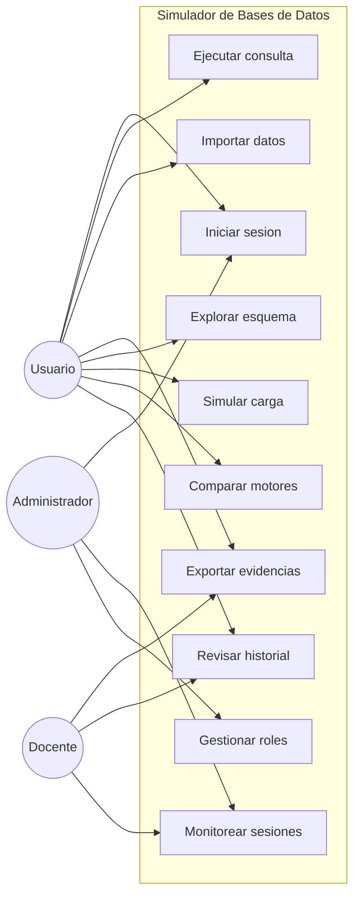

## 3.2 Vista Logica

### 3.2.1 Diagrama de Subsistemas

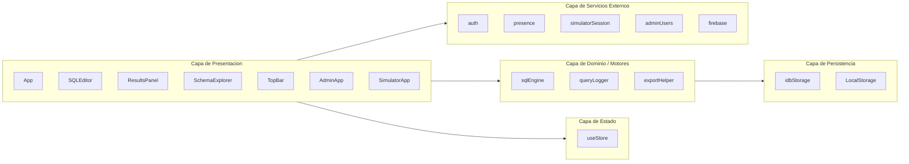

### 3.2.2 Diagrama de Secuencia

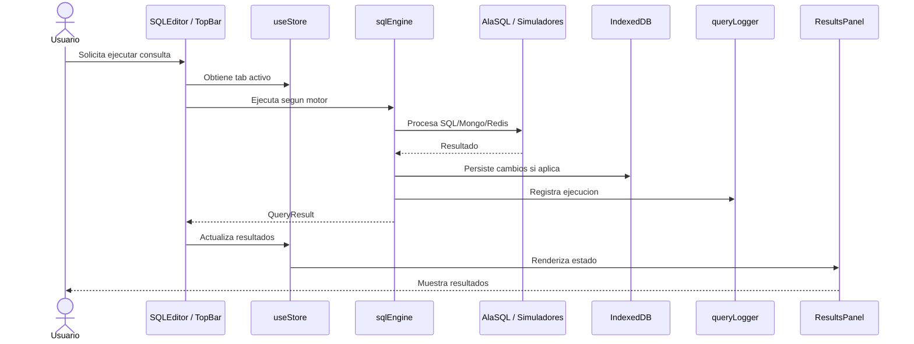

### 3.2.3 Diagrama de Colaboracion

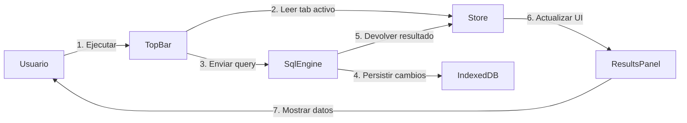

### 3.2.4 Diagrama de Objetos

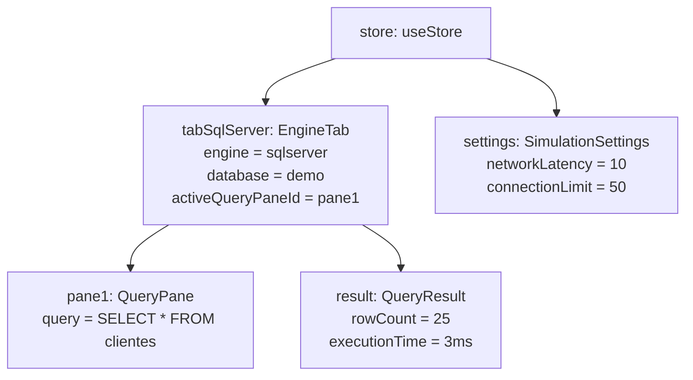

### 3.2.5 Diagrama de Clases

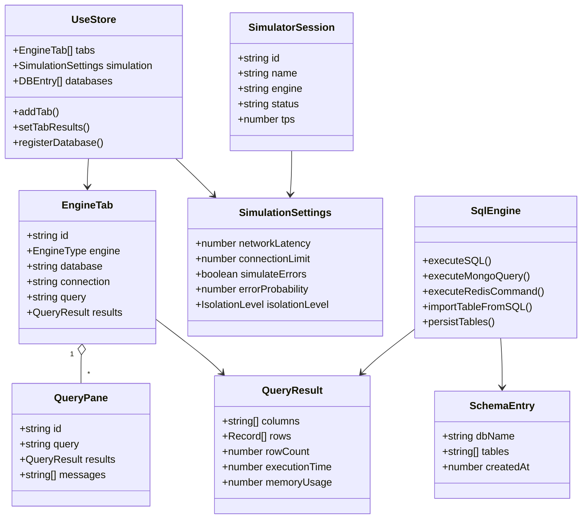

### 3.2.6 Diagrama de Base de Datos / Persistencia

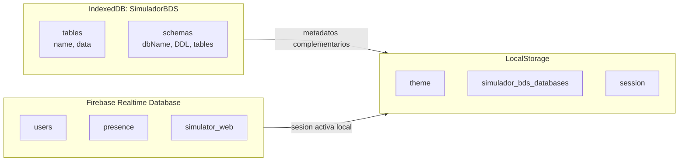

## 3.3 Vista de Implementacion

### 3.3.1 Diagrama de Arquitectura Software

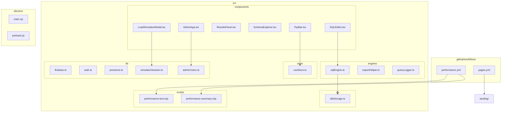

### 3.3.2 Diagrama de Arquitectura del Sistema

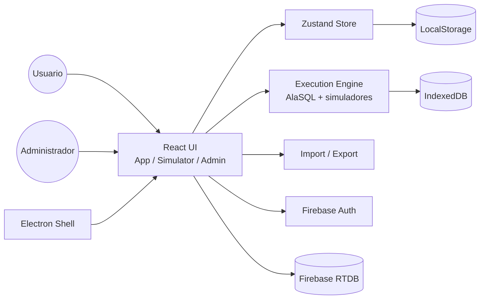

## 3.4 Vista de Procesos

### 3.4.1 Diagrama de Procesos del Sistema

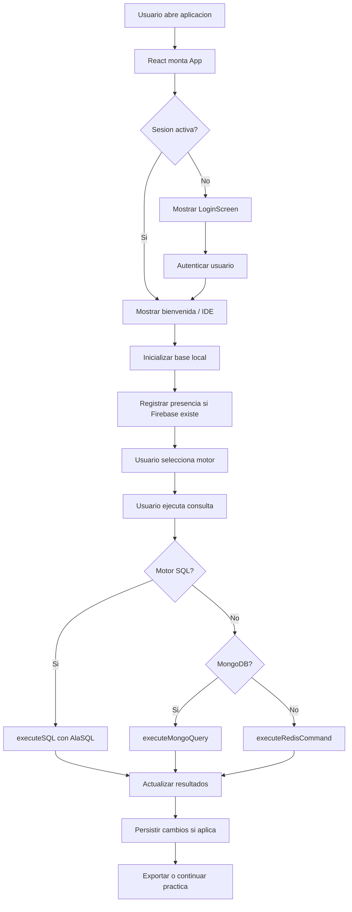

## 3.5 Vista de Despliegue

### 3.5.1 Diagrama de Despliegue

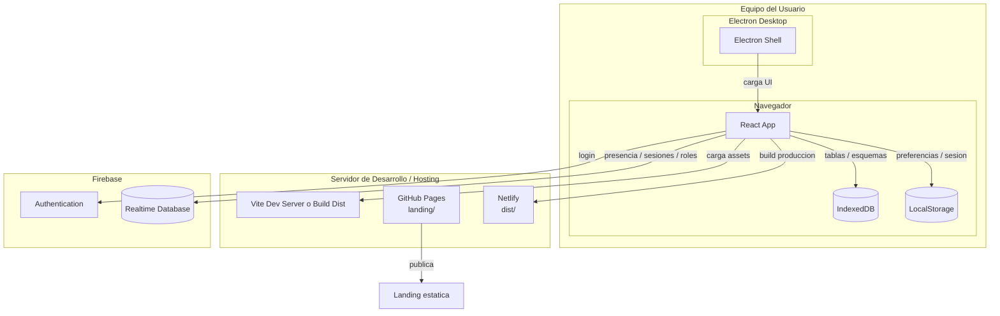

**Escalabilidad:**

- La ejecucion de consultas ocurre en el cliente, reduciendo carga de servidor.
- Firebase escala las funciones de presencia y sesiones.
- El build estatico puede desplegarse en Netlify, Firebase Hosting u otro hosting.
- La landing se despliega automaticamente en GitHub Pages desde `landing/`.
- GitHub Actions ejecuta build y pruebas de rendimiento antes de integrar cambios.

**Disponibilidad:**

- La aplicacion puede funcionar localmente para operaciones que no requieren Firebase.
- La persistencia IndexedDB permite conservar datos entre sesiones del mismo navegador.
- Las funciones admin dependen de disponibilidad de Firebase.

---

# ATRIBUTOS DE CALIDAD DEL SOFTWARE

## 4.1 Escenario de Funcionalidad

| Escenario | Descripcion | Implementacion | Estado |
|---|---|---|---|
| EF001 | Ejecutar SQL local | AlaSQL + `executeSQL` | Implementado |
| EF002 | Simular MongoDB | `executeMongoQuery` | Implementado |
| EF003 | Simular Redis | `executeRedisCommand` | Implementado |
| EF004 | Importar datos | CSV, JSON y SQL | Implementado |
| EF005 | Exportar evidencias | CSV, JSON, Excel, DDL y DB completa | Implementado |
| EF006 | Simular carga | TPS, latencia, CPU, conexiones y errores | Implementado |

## 4.2 Escenario de Usabilidad

| Escenario | Descripcion | Implementacion |
|---|---|---|
| EU001 | Interfaz tipo IDE | Editor, tabs, sidebar, resultados y esquema. |
| EU002 | Acciones visibles | Barra superior con importar, exportar, ayuda y simulador. |
| EU003 | Aprendizaje guiado | Pantalla de bienvenida, plantillas y ayuda. |
| EU004 | Visualizacion clara | Resultados tabulares, metricas y graficos de carga. |

## 4.3 Escenario de Confiabilidad

| Escenario | Descripcion | Implementacion |
|---|---|---|
| EC001 | Persistencia local | IndexedDB conserva tablas y esquemas. |
| EC002 | Registro de ejecucion | Query logger guarda resultados y errores. |
| EC003 | Manejo de Firebase | La app verifica configuracion antes de usar servicios. |
| EC004 | Exportacion | El usuario puede respaldar resultados y sesiones. |

## 4.4 Escenario de Rendimiento

| Metrica | Objetivo | Observacion |
|---|---|---|
| Ejecucion local | Respuesta fluida en practicas academicas. | Depende del equipo cliente y tamano de dataset. |
| Persistencia | Guardar tablas sin backend propio. | IndexedDB es suficiente para laboratorio. |
| Simulacion | Actualizar metricas en tiempo real. | Calculos internos ligeros. |
| Build | Generar assets estaticos. | Vite optimiza salida. |
| CI/CD | Validar rendimiento simulado. | Matriz de 7 motores por 3 escenarios en GitHub Actions. |

## 4.5 Escenario de Mantenibilidad

| Aspecto | Implementacion |
|---|---|
| Modularidad | Componentes, motores, store, db y lib separados. |
| Tipado | TypeScript define motores, resultados y sesiones. |
| Extensibilidad | `ENGINE_CONFIGS` centraliza motores soportados. |
| Reutilizacion | Modales y helpers exportables. |
| Separacion | UI no almacena directamente datos persistentes; usa store y servicios. |

## 4.6 Otros Escenarios

### 4.6.1 Performance

El sistema no busca medir rendimiento real de motores, sino ofrecer una experiencia fluida de laboratorio. El simulador de carga calcula TPS, CPU y latencia mediante formulas internas para representar escenarios didacticos.

### 4.6.2 Escalabilidad

La carga principal se ejecuta en el cliente. Para grupos academicos, Firebase soporta presencia, roles y sesiones del simulador, mientras el frontend puede desplegarse como contenido estatico.

### 4.6.3 Disponibilidad y Confiabilidad

El IDE puede operar parcialmente sin Firebase para consultas locales. Las funciones de login, presencia y admin requieren Firebase configurado. La exportacion de resultados permite respaldar evidencias.

---

# CONCLUSIONES

1. La arquitectura del simulador separa correctamente interfaz, estado, motores, persistencia y servicios externos.
2. El uso de React, Vite y TypeScript permite una base mantenible y portable.
3. AlaSQL e IndexedDB hacen viable la ejecucion local sin backend propio.
4. Firebase agrega autenticacion, presencia y administracion cuando se requiere trabajo monitoreado.
5. Electron extiende el alcance del producto hacia escritorio.
6. La arquitectura es adecuada para fines academicos y puede crecer hacia conectores reales en una version futura.

---

# RECOMENDACIONES

1. Agregar pruebas unitarias para `sqlEngine`, importadores y exportadores.
2. Corregir textos con problemas de codificacion para una presentacion profesional.
3. Documentar configuracion Firebase en un archivo de guia.
4. Agregar capturas o anexos visuales de cada vista principal.
5. Mantener separada cualquier futura conexion real para no confundir el alcance del simulador.
6. Definir limites recomendados de tamanos de dataset para evitar sobrecargar el navegador.

---

**Documento preparado por:** Jhony Vargas Luque y Abel Fernando Pacompia Ortiz  
**Fecha de elaboracion:** 21 de junio de 2026  
**Version:** 2.0  
**Estado:** Aprobado
