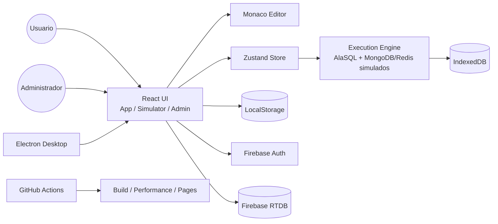

**UNIVERSIDAD PRIVADA DE TACNA**

**FACULTAD DE INGENIERIA**

**Escuela Profesional de Ingenieria de Sistemas**

# Informe Final

## Proyecto Simulador de Bases de Datos

Curso: **Calidad y Pruebas de Software**

Docente: **MAG. Patrick Cuadros Quiroga**

Integrantes:

- **Jhony Vargas Luque (2022075754)**
- **Abel Fernando Pacompia Ortiz (2023076797)**

**Tacna - Peru**

**2026**

\pagebreak

# Control de versiones

| Version | Hecha por | Revisada por | Aprobada por | Fecha | Motivo |
|:--:|:--:|:--:|:--:|:--:|:--|
| 1.0 | APO, JVL | APO, JVL | P. Cuadros Q. | 2026-05-01 | Version inicial |
| 2.0 | APO, JVL | APO, JVL | P. Cuadros Q. | 2026-06-21 | Actualizacion segun implementacion final del simulador |
| 2.1 | APO, JVL | APO, JVL | P. Cuadros Q. | 2026-07-04 | Actualizacion con version actual, GitHub Actions y despliegue |
| 2.2 | APO, JVL | APO, JVL | P. Cuadros Q. | 2026-07-04 | Consolidacion con FD01, FD02, FD03 y FD04 |
| 2.3 | APO, JVL | APO, JVL | P. Cuadros Q. | 2026-07-04 | Actualizacion con manuales, diccionario, estandares y guia de diagramas |

## INDICE GENERAL

1. [Introduccion](#1-introduccion)
2. [Resumen ejecutivo](#2-resumen-ejecutivo)
3. [Documentos base del proyecto](#3-documentos-base-del-proyecto)
4. [Vision general del producto](#4-vision-general-del-producto)
5. [Factibilidad consolidada](#5-factibilidad-consolidada)
6. [Requerimientos implementados](#6-requerimientos-implementados)
7. [Arquitectura y diseno de la solucion](#7-arquitectura-y-diseno-de-la-solucion)
8. [Desarrollo de la solucion](#8-desarrollo-de-la-solucion)
9. [Pruebas y validacion](#9-pruebas-y-validacion)
10. [Resultados obtenidos](#10-resultados-obtenidos)
11. [Limitaciones del proyecto](#11-limitaciones-del-proyecto)
12. [Presupuesto final](#12-presupuesto-final)
13. [Conclusiones](#13-conclusiones)
14. [Recomendaciones](#14-recomendaciones)
15. [Bibliografia](#15-bibliografia)
16. [Webgrafia](#16-webgrafia)
17. [Anexos](#17-anexos)

\pagebreak

## 1. Introduccion

El presente informe final consolida los resultados del proyecto **Simulador de Bases de Datos**, desarrollado como una herramienta academica para practicar consultas SQL y NoSQL, importar datos, explorar esquemas, exportar evidencias y simular condiciones de carga sin instalar servidores de bases de datos reales.

Este documento toma como base los informes previos del proyecto: **FD01 - Informe de Factibilidad**, **FD02 - Documento de Vision**, **FD03 - Especificacion de Requerimientos de Software** y **FD04 - Arquitectura de Software**. A partir de ellos se presenta una vision integrada del problema, la solucion implementada, los requerimientos cubiertos, la arquitectura, las pruebas realizadas y los resultados obtenidos.

## 2. Resumen ejecutivo

El proyecto responde a la necesidad de contar con un entorno unico, portable y accesible para practicar bases de datos en un contexto academico. La instalacion y configuracion de motores como SQL Server, MySQL, PostgreSQL, Oracle, SQLite, MongoDB y Redis puede ser compleja para estudiantes que recien inician. Por ello, el simulador permite ejecutar ejercicios representativos en el navegador o en una version desktop, reduciendo la dependencia de infraestructura externa.

La version actual del sistema incluye:

- Aplicacion web tipo IDE con React, TypeScript y Monaco Editor.
- Soporte para motores simulados SQL Server, MySQL, PostgreSQL, Oracle, SQLite, MongoDB y Redis.
- Ejecucion SQL en memoria mediante AlaSQL.
- Simulacion de comandos basicos MongoDB y Redis.
- Importacion de datos desde SQL, CSV y JSON.
- Persistencia local de tablas, esquemas y metadatos con IndexedDB.
- Exportacion de resultados en CSV, JSON, Excel, SQL y formatos por motor.
- Explorador de esquema, historial, logs y configuracion de editor.
- Simulador de carga con TPS, latencia, CPU estimada, conexiones, errores y comparacion de motores.
- Panel administrativo con autenticacion, presencia, sesiones y roles mediante Firebase.
- Empaquetado desktop con Electron.
- Automatizacion con GitHub Actions para pruebas de rendimiento y despliegue de landing.

## 3. Documentos base del proyecto

| Documento | Proposito | Aporte al informe final |
|---|---|---|
| FD01 - Informe de Factibilidad | Evalua la viabilidad tecnica, economica, operativa, legal, social y ambiental. | Confirma que el proyecto es viable para fines academicos con costo estimado bajo. |
| FD02 - Documento de Vision | Define el producto, usuarios, necesidades, capacidades, restricciones y calidad esperada. | Establece el alcance funcional y la perspectiva del sistema. |
| FD03 - SRS | Especifica requisitos funcionales, no funcionales, reglas de negocio, casos de uso y trazabilidad. | Sustenta que el sistema implementa los requisitos principales. |
| FD04 - SAD | Describe arquitectura, vistas 4+1, C4, componentes, datos, despliegue, seguridad y calidad. | Explica como esta construido el sistema y como se relacionan sus modulos. |

### 3.1 Documentos complementarios

| Documento | Proposito | Uso en la entrega |
|---|---|---|
| Diccionario de Datos | Describe estructuras, persistencia, Firebase, reportes y exportaciones. | Sirve como referencia tecnica para datos internos y evidencias. |
| Estandares de Programacion | Define reglas de codigo, documentacion, Mermaid, pruebas y CI/CD. | Sirve como criterio de mantenimiento y revision. |
| Guia de Diagramas FD03-FD04 | Explica que diagramas corresponden al SRS, SAD e informe final. | Sirve para validar que cada grafico este en el documento correcto. |
| Manual de Instalacion | Describe instalacion, ejecucion, build, desktop, CI/CD y verificacion documental. | Sirve para reproducir el proyecto y preparar la entrega. |
| Manual de Usuario | Explica uso del IDE, motores, importacion, exportacion, simulador y admin. | Sirve para operar el sistema y generar evidencias. |

## 4. Vision general del producto

El **Simulador de Bases de Datos** es una aplicacion web y desktop orientada a estudiantes, docentes, administradores academicos y desarrolladores del proyecto. Su finalidad es permitir la practica de operaciones de bases de datos sin instalar varios servidores reales, manteniendo un entorno controlado, visual y facil de usar.

### 4.1 Usuarios principales

| Usuario | Necesidad principal |
|---|---|
| Estudiante | Practicar consultas, importar datos, revisar resultados y exportar evidencias. |
| Docente | Proponer ejercicios, verificar resultados y usar el simulador en laboratorio. |
| Administrador | Monitorear sesiones, motores activos y usuarios conectados. |
| Desarrollador | Mantener componentes, motores, persistencia, exportadores y pruebas automatizadas. |

### 4.2 Capacidades del producto

| Capacidad | Descripcion |
|---|---|
| Multi-motor | Trabaja con SQL Server, MySQL, PostgreSQL, Oracle, SQLite, MongoDB y Redis. |
| Editor tipo IDE | Permite escribir y ejecutar consultas con Monaco Editor. |
| Persistencia local | Conserva tablas y esquemas mediante IndexedDB. |
| Importacion | Carga datos desde archivos SQL, CSV y JSON. |
| Exportacion | Genera evidencias en CSV, JSON, Excel, SQL y formatos por motor. |
| Simulacion de carga | Calcula metricas didacticas de TPS, latencia, CPU, conexiones y errores. |
| Administracion | Usa Firebase para autenticacion, presencia, roles y sesiones cuando esta configurado. |
| Portabilidad | Funciona como web app y puede empaquetarse con Electron. |
| CI/CD | Ejecuta validaciones de rendimiento y publica la landing con GitHub Actions. |

## 5. Factibilidad consolidada

La factibilidad del proyecto se considera **alta**. El sistema se construyo con tecnologias accesibles, documentadas y compatibles con el alcance academico. No requiere licencias pagadas para su ejecucion base y puede operar localmente en el navegador para las funciones principales.

| Dimension | Resultado | Sustento |
|---|---|---|
| Tecnica | Alta | React, TypeScript, Vite, AlaSQL, IndexedDB, Firebase, Electron y GitHub Actions son tecnologias viables para el alcance. |
| Economica | Alta | El proyecto usa herramientas gratuitas y recursos propios. El costo estimado final es S/. 2005.00. |
| Operativa | Alta | El flujo tipo IDE facilita el uso en laboratorios y practicas academicas. |
| Legal | Alta | El sistema se orienta a datos de prueba y uso academico. Las credenciales externas no deben publicarse. |
| Social y ambiental | Alta | Reduce instalaciones locales complejas y favorece el aprendizaje con bajo consumo de infraestructura. |

## 6. Requerimientos implementados

El SRS del proyecto define requisitos funcionales y no funcionales alineados con ISO/IEC/IEEE 29148 y UML. La version actual cubre los requerimientos principales mediante componentes concretos del codigo.

### 6.1 Requerimientos funcionales principales

| Codigo | Requerimiento | Implementacion | Estado |
|---|---|---|---|
| RF001 | Autenticacion | `LoginScreen`, `auth.ts` | Implementado |
| RF002 | Editor Monaco | `SQLEditor` | Implementado |
| RF003 | Tabs por motor | `EngineTabs`, `useStore` | Implementado |
| RF004 | SQL relacional | `sqlEngine.ts`, AlaSQL | Implementado |
| RF006 | MongoDB simulado | `executeMongoQuery` | Implementado |
| RF007 | Redis simulado | `executeRedisCommand` | Implementado |
| RF008 | Importar CSV | `importTableFromCSV` | Implementado |
| RF009 | Importar JSON | `importTableFromJSON` | Implementado |
| RF010 | Importar SQL | `importTableFromSQL` | Implementado |
| RF011 | Persistencia local | `idbStorage.ts` | Implementado |
| RF013 | Exportacion | `ExportModal`, `exportHelper` | Implementado |
| RF014 | Explorador de esquema | `SchemaExplorer` | Implementado |
| RF015 | Historial y logs | `HistoryModal`, `queryLogger` | Implementado |
| RF017 | Simulador de carga | `LoadSimulatorModal` | Implementado |
| RF018 | Comparacion de motores | `LoadSimulatorModal` | Implementado |
| RF020 | Panel admin | `AdminApp` | Implementado |
| RF021 | Presencia | `presence.ts`, Firebase | Implementado |
| RF022 | Desktop | `electron/main.cjs` | Implementado |
| RF023 | CI/CD rendimiento | `.github/workflows/performance.yml` | Implementado |
| RF024 | Despliegue landing | `.github/workflows/pages.yml` | Implementado |

### 6.2 Requerimientos no funcionales

| Codigo | Atributo | Cumplimiento |
|---|---|---|
| RNF001 | Usabilidad | Interfaz tipo IDE, modales claros, editor con resaltado y paneles visibles. |
| RNF002 | Rendimiento | Ejecucion local en memoria e IndexedDB para practicas de laboratorio. |
| RNF003 | Portabilidad | Ejecucion web con Vite y version desktop mediante Electron. |
| RNF004 | Mantenibilidad | Separacion por componentes, store, motores, servicios y persistencia. |
| RNF005 | Auditabilidad | Historial, logs, exportaciones y reportes de pruebas. |
| RNF006 | Configurabilidad | Parametros de editor, entorno y simulacion ajustables. |
| RNF007 | Seguridad | Autenticacion y roles mediante Firebase para funciones administrativas. |
| RNF008 | Compatibilidad | Funcionamiento esperado en navegadores modernos. |
| RNF009 | Claridad | Documentacion indica que los motores son simulados. |
| RNF010 | Persistencia local | IndexedDB conserva tablas y esquemas entre sesiones del navegador. |
| RNF011 | Integracion continua | GitHub Actions valida rendimiento simulado y despliegue. |

## 7. Arquitectura y diseno de la solucion

La arquitectura documentada en FD04 se organiza bajo el enfoque 4+1, C4 y una separacion modular entre interfaz, estado, motores, persistencia, servicios externos, build y despliegue. En la version final, FD04 incluye diagramas Mermaid dentro de cada vista principal: caso de uso, vista logica, procesos, despliegue, implementacion, datos y calidad.

### 7.1 Capas principales

| Capa | Responsabilidad |
|---|---|
| Presentacion | Componentes React, pantallas, modales, editor, resultados y panel admin. |
| Estado | Zustand centraliza pestanas, motores, resultados, historial y configuracion. |
| Motor de ejecucion | AlaSQL procesa SQL; funciones internas simulan MongoDB y Redis. |
| Persistencia | IndexedDB guarda tablas y esquemas; LocalStorage guarda preferencias. |
| Servicios externos | Firebase Auth y Realtime Database soportan login, presencia, roles y sesiones. |
| Distribucion | Vite genera build web; Electron empaqueta desktop; GitHub Actions automatiza pruebas y despliegue. |

### 7.2 Decisiones arquitectonicas

- Ejecutar las practicas principalmente en el navegador para reducir instalacion de infraestructura.
- Mantener MongoDB y Redis como simulaciones internas, no como conexiones a servidores reales.
- Usar IndexedDB para conservar datos academicos de practica entre sesiones.
- Separar el panel administrativo de la aplicacion principal mediante `admin.html`.
- Permitir degradacion controlada cuando Firebase no esta configurado.
- Automatizar validaciones mediante GitHub Actions para mejorar la confiabilidad del proyecto.

## 8. Desarrollo de la solucion

### 8.1 Modulos implementados

| Modulo | Descripcion |
|---|---|
| `src/App.tsx` | Aplicacion principal, sesion, layout y presencia. |
| `src/components/SQLEditor.tsx` | Editor y ejecucion de consultas. |
| `src/components/ResultsPanel.tsx` | Visualizacion y exportacion de resultados. |
| `src/components/SchemaExplorer.tsx` | Exploracion de bases, tablas y columnas. |
| `src/components/EngineTabs.tsx` | Pestanas por motor. |
| `src/components/DatabaseManagerModal.tsx` | Importacion de SQL, CSV y JSON. |
| `src/components/LoadSimulatorModal.tsx` | Simulador de carga y comparacion de motores. |
| `src/AdminApp.tsx` | Panel de administracion. |
| `src/store/useStore.ts` | Estado global de la aplicacion. |
| `src/engines/sqlEngine.ts` | Motor SQL, MongoDB, Redis, importacion y persistencia. |
| `src/engines/exportHelper.ts` | Exportacion por motor. |
| `src/db/idbStorage.ts` | Persistencia en IndexedDB. |
| `src/lib/auth.ts` | Autenticacion. |
| `src/lib/presence.ts` | Usuarios conectados. |
| `src/lib/simulatorSession.ts` | Actividad del simulador. |
| `electron/main.cjs` | Empaquetado desktop. |
| `scripts/performance-test.mjs` | Prueba automatica de rendimiento por motor y escenario. |
| `scripts/performance-summary.mjs` | Resumen consolidado de reportes de rendimiento. |
| `.github/workflows/performance.yml` | Workflow Database Load Performance. |
| `.github/workflows/pages.yml` | Workflow Deploy Landing Page. |

### 8.2 Entradas principales del sistema

- `app.html`: aplicacion principal del simulador.
- `simulator.html`: vista orientada al simulador de carga.
- `admin.html`: panel administrativo.
- `/app`, `/simulador` y `/admin`: rutas web configuradas para despliegue.
- `landing/`: landing estatica del proyecto.

### 8.3 Motores soportados

| Motor | Tipo | Implementacion |
|---|---|---|
| SQL Server | Relacional simulado | Preprocesamiento y ejecucion con AlaSQL. |
| MySQL | Relacional simulado | Ejecucion SQL en memoria. |
| PostgreSQL | Relacional simulado | Ejecucion SQL en memoria. |
| Oracle | Relacional simulado | Preprocesamiento y ejecucion con AlaSQL. |
| SQLite | Relacional simulado | Ejecucion SQL en memoria. |
| MongoDB | Documento simulado | Comandos como `find`, `insertOne`, `updateOne` y `deleteOne`. |
| Redis | Clave-valor simulado | Comandos como `SET`, `GET`, `HSET`, `LPUSH`, `SADD` e `INCR`. |

## 9. Pruebas y validacion

El proyecto incorpora pruebas manuales, validaciones funcionales y automatizacion de rendimiento. El workflow principal de CI ejecuta una matriz de 21 combinaciones: 7 motores por 3 escenarios (`light`, `medium`, `heavy`).

| Prueba | Herramienta | Resultado esperado |
|---|---|---|
| Instalacion | `npm install` | Dependencias instaladas correctamente. |
| Desarrollo web | `npm run dev` | Servidor Vite disponible. |
| Build | `npm run build` | Compilacion TypeScript y build Vite sin errores. |
| SQL basico | Editor principal | Ejecuta `CREATE TABLE`, `INSERT` y `SELECT`. |
| Importacion CSV | Modal importar | Crea tabla desde archivo CSV. |
| Importacion JSON | Modal importar | Crea tabla desde arreglo u objeto JSON. |
| Importacion SQL | Modal importar | Crea tablas e inserta registros. |
| MongoDB simulado | Editor MongoDB | Ejecuta operaciones basicas de documentos. |
| Redis simulado | Editor Redis | Ejecuta estructuras clave-valor, hashes, listas y sets. |
| Exportacion | Panel resultados | Descarga CSV, JSON, Excel, SQL y formatos por motor. |
| Simulacion carga | Modal simulador | Muestra TPS, latencia, CPU, conexiones y errores. |
| Comparacion | Modal simulador | Compara metricas entre motores simulados. |
| Admin | `admin.html` | Muestra usuarios, sesiones y roles si Firebase esta configurado. |
| CI rendimiento | GitHub Actions / `npm run test:performance` | Genera reportes por motor y valida umbrales. |
| Landing | GitHub Pages / `landing/` | Publica la pagina estatica del proyecto. |

## 10. Resultados obtenidos

El sistema cumple con los objetivos definidos en FD02 y con los requerimientos principales documentados en FD03. La solucion permite practicar consultas, administrar datos locales, exportar resultados, simular carga y monitorear sesiones academicas cuando Firebase esta disponible.

Los resultados mas relevantes son:

- Se logro una herramienta academica funcional para SQL y NoSQL simulado.
- Se redujo la necesidad de instalar motores reales para practicas introductorias.
- Se implemento una interfaz tipo IDE con multiples pestanas y paneles.
- Se incorporo persistencia local con IndexedDB.
- Se agrego importacion y exportacion de datos en formatos utiles para evidencias.
- Se implemento simulacion de carga y comparacion entre motores.
- Se integro panel administrativo, presencia y roles con Firebase.
- Se preparo distribucion web y desktop con Vite y Electron.
- Se agrego automatizacion con GitHub Actions para rendimiento y landing.

La version actual registrada en `package.json` es **1.8.0**.

## 11. Limitaciones del proyecto

- El simulador no reemplaza motores reales de bases de datos.
- SQL Server, MySQL, PostgreSQL, Oracle y SQLite se representan sobre ejecucion local en memoria, por lo que algunas diferencias avanzadas de dialecto no estan cubiertas.
- MongoDB y Redis son simulaciones internas, no conexiones a servicios reales.
- Los datos locales pueden perderse si el navegador elimina IndexedDB o si el usuario cambia de navegador.
- Las funciones de autenticacion, presencia, sesiones y administracion dependen de Firebase configurado correctamente.
- Las metricas del simulador de carga son didacticas y no deben interpretarse como benchmarks reales.
- No se incluyen procedimientos almacenados, triggers avanzados, replicacion, particionamiento ni funciones especificas de motores reales.

## 12. Presupuesto final

| Concepto | Costo estimado |
|---|---:|
| Herramientas de software | S/. 0.00 |
| Equipo propio | S/. 0.00 |
| Internet y energia | S/. 130.00 |
| Materiales y documentacion | S/. 275.00 |
| Tiempo de desarrollo academico | S/. 1600.00 |
| **Total** | **S/. 2005.00** |

## 13. Conclusiones

1. El **Simulador de Bases de Datos** cumple el objetivo de ofrecer un entorno academico para practicar SQL y NoSQL sin instalar motores reales.
2. La solucion es viable tecnica, economica, operativa, legal, social y ambientalmente para el contexto del curso.
3. El sistema implementa los requisitos principales del SRS, incluyendo autenticacion, editor, motores, importacion, exportacion, persistencia, historial, simulacion y administracion.
4. La arquitectura basada en React, TypeScript, Vite, Zustand, AlaSQL, IndexedDB, Firebase y Electron permite una solucion modular y mantenible.
5. Los diagramas y vistas de FD03 y FD04 explican correctamente la diferencia entre requisitos del sistema y diseno de la solucion.
6. El simulador de carga aporta una herramienta didactica para observar conceptos de TPS, latencia, saturacion, errores y comparacion entre motores.
7. GitHub Actions fortalece el proyecto al automatizar validaciones de rendimiento y despliegue de la landing.
8. La solucion final es adecuada para practicas guiadas, demostraciones academicas y evaluaciones de laboratorio.

## 14. Recomendaciones

- Mantener visible en la documentacion que el sistema es un simulador academico y no un motor real.
- Agregar mas ejercicios guiados por motor y por nivel de dificultad.
- Documentar la configuracion de Firebase para entornos de prueba y entrega.
- Ampliar pruebas unitarias sobre `sqlEngine.ts`, importadores, exportadores y simulador de carga.
- Incorporar capturas de pantalla actualizadas en los anexos de entrega.
- Mantener credenciales y variables de entorno fuera del repositorio.
- Evaluar una version futura con conectores reales opcionales, separada del modo simulado.
- Revisar periodicamente compatibilidad con versiones nuevas de React, Vite, Electron y Firebase.

## 15. Bibliografia

- Sommerville, I. (2016). *Software Engineering*.
- Pressman, R. S., & Maxim, B. R. (2020). *Software Engineering: A Practitioner's Approach*.
- Silberschatz, A., Korth, H. F., & Sudarshan, S. (2019). *Database System Concepts*.
- Elmasri, R., & Navathe, S. B. (2016). *Fundamentals of Database Systems*.

## 16. Webgrafia

- React Documentation: https://react.dev/
- TypeScript Documentation: https://www.typescriptlang.org/docs/
- Vite Documentation: https://vitejs.dev/
- Monaco Editor: https://microsoft.github.io/monaco-editor/
- AlaSQL: https://alasql.org/
- Firebase Documentation: https://firebase.google.com/docs
- Electron Documentation: https://www.electronjs.org/docs
- MDN IndexedDB: https://developer.mozilla.org/en-US/docs/Web/API/IndexedDB_API
- GitHub Actions Documentation: https://docs.github.com/actions

## 17. Anexos

- FD01: Informe de Factibilidad.
- FD02: Documento de Vision.
- FD03: Especificacion de Requerimientos de Software.
- FD04: Arquitectura de Software.
- Diccionario de Datos.
- Estandares de Programacion.
- Guia de diagramas FD03-FD04.
- Manual de Instalacion.
- Manual de Usuario.
- README del proyecto.
- Archivos de configuracion y scripts de ejecucion.
- Workflows de GitHub Actions.
- Reportes de rendimiento generados por el proyecto.
