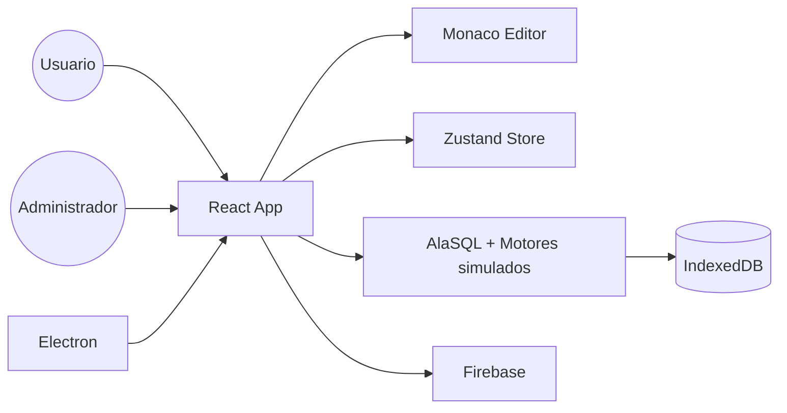

**UNIVERSIDAD PRIVADA DE TACNA**

**FACULTAD DE INGENIERIA**

**Escuela Profesional de Ingenieria de Sistemas**

# Informe Final

## Proyecto Simulador de Bases de Datos

Curso: **Calidad y Pruebas de Software**

Docente: **MAG. Patrick Cuadros Quiroga**

Integrantes:

- **Jhony Vargas Luque (2022075754)**
- **Abel Fernando Pacompia Ortiz (2023076797)**

**Tacna - Peru**

**2026**

\pagebreak

# Control de versiones

| Version | Hecha por | Revisada por | Aprobada por | Fecha | Motivo |
|:--:|:--:|:--:|:--:|:--:|:--|
| 1.0 | APO, JVL | APO, JVL | P. Cuadros Q. | 2026-05-01 | Version inicial |
| 2.0 | APO, JVL | APO, JVL | P. Cuadros Q. | 2026-06-21 | Actualizacion segun implementacion final del simulador |
| 2.1 | APO, JVL | APO, JVL | P. Cuadros Q. | 2026-07-04 | Actualizacion con version actual, GitHub Actions y despliegue |

## 1. Antecedentes

El **Simulador de Bases de Datos** surge como proyecto academico para aplicar conocimientos de desarrollo de software, bases de datos, pruebas, interfaces de usuario y simulacion de rendimiento. El sistema permite practicar consultas SQL y NoSQL en un entorno local sin instalar varios motores de base de datos.

Durante el desarrollo, el proyecto evoluciono desde un editor de consultas hacia una herramienta mas completa con multiples motores simulados, importacion/exportacion, persistencia local, explorador de esquema, historial, simulador de carga, panel administrativo y empaquetado desktop.

## 2. Planteamiento del problema

Aprender bases de datos puede requerir instalar y configurar distintos motores, servicios, credenciales, puertos y clientes. En entornos academicos, este proceso consume tiempo y puede impedir que el estudiante se concentre en practicar consultas y comprender diferencias entre motores.

El proyecto atiende esta necesidad ofreciendo una herramienta local y gratuita para:

- Practicar consultas SQL y NoSQL.
- Comparar sintaxis entre motores.
- Importar datos de prueba.
- Visualizar resultados y esquemas.
- Exportar evidencias.
- Simular carga y saturacion.
- Administrar usuarios y sesiones en un contexto academico.

## 3. Objetivos

### 3.1 Objetivo general

Desarrollar un simulador academico de bases de datos que permita ejecutar consultas, gestionar datos locales, exportar resultados y simular condiciones de carga en distintos motores sin instalar servidores reales.

### 3.2 Objetivos especificos

- Implementar una interfaz web tipo IDE con React y TypeScript.
- Integrar Monaco Editor para escritura de consultas.
- Soportar motores simulados SQL Server, MySQL, PostgreSQL, Oracle, SQLite, MongoDB y Redis.
- Ejecutar consultas SQL mediante AlaSQL.
- Simular operaciones basicas de MongoDB y Redis.
- Importar datos desde SQL, CSV y JSON.
- Persistir tablas y esquemas en IndexedDB.
- Exportar resultados en CSV, JSON y Excel.
- Exportar esquemas y bases completas por motor.
- Implementar historial y logs de consultas.
- Agregar simulador de carga con TPS, latencia, CPU, conexiones y errores.
- Implementar panel administrativo con monitoreo y roles.
- Permitir ejecucion web y empaquetado desktop con Electron.
- Automatizar validaciones de rendimiento con GitHub Actions.
- Publicar la landing estatica mediante GitHub Pages.

## 4. Marco teorico

### 4.1 Simulador de bases de datos

Un simulador de bases de datos reproduce comportamientos representativos de motores reales para fines de aprendizaje. No busca reemplazar un servidor real, sino reducir la complejidad inicial y permitir practicas controladas.

### 4.2 SQL y NoSQL

SQL permite definir, consultar y manipular datos relacionales mediante sentencias como `SELECT`, `INSERT`, `UPDATE`, `DELETE` y `CREATE TABLE`. NoSQL agrupa modelos no relacionales como documentos y clave-valor; en este proyecto se representan mediante comandos simulados de MongoDB y Redis.

### 4.3 Persistencia local

IndexedDB permite almacenar informacion estructurada en el navegador. El proyecto la usa para persistir tablas, datos y metadatos sin depender de un backend propio.

### 4.4 Simulacion de carga

La simulacion de carga estima metricas como usuarios concurrentes, TPS, latencia, CPU, conexiones y errores. En este proyecto las metricas son didacticas y se calculan con formulas internas; no representan mediciones reales sobre motores externos.

### 4.5 Herramientas

| Herramienta | Uso |
|---|---|
| React + TypeScript | Desarrollo de la interfaz. |
| Vite | Build y servidor de desarrollo. |
| Tailwind CSS | Estilos visuales. |
| Monaco Editor | Editor de codigo. |
| AlaSQL | Ejecucion SQL en memoria. |
| IndexedDB | Persistencia local. |
| Zustand | Estado global. |
| Firebase | Autenticacion, presencia y admin. |
| Electron | Aplicacion desktop. |
| SheetJS | Exportacion Excel. |

## 5. Desarrollo de la solucion

### 5.1 Modulos implementados

| Modulo | Descripcion |
|---|---|
| `src/App.tsx` | Aplicacion principal, sesion, layout y presencia. |
| `src/components/SQLEditor.tsx` | Editor y ejecucion de consultas. |
| `src/components/ResultsPanel.tsx` | Visualizacion y exportacion de resultados. |
| `src/components/SchemaExplorer.tsx` | Exploracion de bases, tablas y columnas. |
| `src/components/TopBar.tsx` | Acciones principales del IDE. |
| `src/components/EngineTabs.tsx` | Pestanas por motor. |
| `src/components/DatabaseManagerModal.tsx` | Importacion de SQL, CSV y JSON. |
| `src/components/LoadSimulatorModal.tsx` | Simulador de carga. |
| `src/AdminApp.tsx` | Panel de administracion. |
| `src/store/useStore.ts` | Estado global. |
| `src/engines/sqlEngine.ts` | Motor SQL, MongoDB, Redis, importacion y persistencia. |
| `src/engines/exportHelper.ts` | Exportacion por motor. |
| `src/db/idbStorage.ts` | Persistencia IndexedDB. |
| `src/lib/auth.ts` | Autenticacion. |
| `src/lib/presence.ts` | Usuarios conectados. |
| `src/lib/simulatorSession.ts` | Actividad del simulador. |
| `electron/main.cjs` | Empaquetado desktop. |
| `scripts/performance-test.mjs` | Prueba automatica de rendimiento por motor y escenario. |
| `scripts/performance-summary.mjs` | Resumen consolidado de reportes de rendimiento. |
| `.github/workflows/performance.yml` | Workflow Database Load Performance. |
| `.github/workflows/pages.yml` | Workflow Deploy Landing Page. |

### 5.2 Motores implementados

- `SQL Server`
- `MySQL`
- `PostgreSQL`
- `Oracle`
- `SQLite`
- `MongoDB`
- `Redis`

### 5.3 Aplicacion principal

La aplicacion principal incluye:

- Inicio de sesion y registro.
- Pantalla de bienvenida.
- Editor con multiples tabs.
- Ejecucion de consultas.
- Ejecucion de seleccion parcial.
- Explorador de esquema.
- Resultados tabulares.
- Mensajes y errores.
- Historial y logs.
- Importacion y exportacion.
- Configuracion de tema y editor.

### 5.4 Simulador de carga

El simulador permite configurar:

- Motor principal.
- Duracion.
- Usuarios maximos.
- Rampa de usuarios.
- Tipos de consulta.
- Comparacion entre motores.
- Modo progresivo hasta saturacion.

Los resultados incluyen TPS, pico TPS, latencia, CPU estimada, conexiones, errores, logs de scripts y veredictos de rendimiento simulado.

### 5.5 Panel administrativo

El panel admin permite:

- Autenticacion de administrador.
- Monitoreo de sesiones activas.
- Revision de motores activos.
- Visualizacion de TPS promedio.
- Gestion de usuarios y roles.

## 6. Arquitectura resumida

## 7. Pruebas realizadas

| Prueba | Herramienta | Resultado esperado |
|---|---|---|
| Instalacion | `npm install` | Dependencias instaladas correctamente. |
| Desarrollo web | `npm run dev` | Servidor Vite disponible. |
| Build | `npm run build` | Compilacion TypeScript y build Vite sin errores. |
| SQL basico | Editor principal | Ejecuta `CREATE TABLE`, `INSERT` y `SELECT`. |
| Importacion CSV | Modal importar | Crea tabla desde archivo CSV. |
| Importacion JSON | Modal importar | Crea tabla desde arreglo u objeto JSON. |
| Importacion SQL | Modal importar | Crea tablas e inserta registros. |
| MongoDB simulado | Editor MongoDB | Ejecuta `find`, `insertOne`, `updateOne` y `deleteOne`. |
| Redis simulado | Editor Redis | Ejecuta `SET`, `GET`, `HSET`, `LPUSH`, `SADD` e `INCR`. |
| Exportacion resultados | Panel resultados | Descarga CSV, JSON y Excel. |
| Simulacion carga | Modal simulador | Muestra TPS, latencia, CPU y errores. |
| Comparacion | Modal simulador | Muestra metricas para dos motores. |
| Admin | `admin.html` | Muestra usuarios y sesiones si Firebase esta configurado. |
| CI rendimiento | GitHub Actions / `npm run test:performance` | Genera reportes por motor y valida umbrales. |
| Landing | GitHub Pages / `landing/` | Publica pagina estatica del proyecto. |

## 8. Resultados

El sistema cumple con los objetivos definidos. Permite practicar consultas, importar datos, explorar esquemas, exportar evidencias y simular carga. Tambien incorpora funcionalidades de administracion y monitoreo que enriquecen el uso academico.

Los artefactos principales son:

- Aplicacion principal: `app.html`.
- Simulador independiente: `simulator.html`.
- Panel admin: `admin.html`.
- Motor de ejecucion: `src/engines/sqlEngine.ts`.
- Simulador de carga: `src/components/LoadSimulatorModal.tsx`.
- Persistencia local: `src/db/idbStorage.ts`.
- Configuracion de build: `vite.config.ts`.
- Empaquetado desktop: `electron/main.cjs`.
- Workflow de rendimiento: `.github/workflows/performance.yml`.
- Workflow de landing: `.github/workflows/pages.yml`.

La version actual del proyecto en `package.json` es **1.8.0**. La automatizacion principal es **Database Load Performance**, que ejecuta una matriz de 21 combinaciones: 7 motores por 3 escenarios (`light`, `medium`, `heavy`). Cada combinacion valida latencia promedio, latencia p95, TPS y tasa de errores. Al finalizar, se genera un artifact consolidado `performance-summary` en Markdown, JSON y CSV.

## 9. Presupuesto

| Concepto | Costo estimado |
|---|---:|
| Herramientas de software | S/. 0.00 |
| Equipo propio | S/. 0.00 |
| Internet y energia | S/. 130.00 |
| Materiales y documentacion | S/. 275.00 |
| Tiempo de desarrollo academico | S/. 1600.00 |
| **Total** | **S/. 2005.00** |

## 10. Conclusiones

1. El **Simulador de Bases de Datos** cumple el objetivo de ofrecer un entorno academico para practicar SQL y NoSQL sin instalar motores reales.
2. El sistema implementa una interfaz completa tipo IDE con editor, tabs, resultados, esquema, historial, importacion y exportacion.
3. La simulacion de MongoDB y Redis amplia el alcance mas alla de bases relacionales.
4. IndexedDB permite persistencia local suficiente para practicas de laboratorio.
5. El simulador de carga aporta una vista didactica de rendimiento, saturacion y comparacion entre motores.
6. El panel administrativo y Firebase agregan capacidades de monitoreo y gestion de usuarios.
7. Electron permite distribuir el sistema como aplicacion desktop.
8. GitHub Actions mejora la calidad del proyecto al automatizar build, pruebas de rendimiento y publicacion de la landing.
9. La solucion es viable para fines academicos, practicas guiadas y demostraciones.

## 11. Recomendaciones

- Corregir textos con problemas de codificacion para mejorar la presentacion final.
- Agregar pruebas automatizadas para los motores simulados.
- Documentar claramente las diferencias entre simulacion y motores reales.
- Agregar mas plantillas por motor y ejercicios guiados.
- Evaluar una capa opcional de conexion real en una version futura separada.
- Mejorar mensajes de error por dialecto.
- Mantener las credenciales Firebase fuera del repositorio.
- Agregar capturas de pantalla y guia de uso para la entrega final.

## 12. Bibliografia

- Sommerville, I. (2016). *Software Engineering*.
- Pressman, R. S., & Maxim, B. R. (2020). *Software Engineering: A Practitioner's Approach*.
- Silberschatz, A., Korth, H. F., & Sudarshan, S. (2019). *Database System Concepts*.
- Elmasri, R., & Navathe, S. B. (2016). *Fundamentals of Database Systems*.

## 13. Webgrafia

- React Documentation: https://react.dev/
- TypeScript Documentation: https://www.typescriptlang.org/docs/
- Vite Documentation: https://vitejs.dev/
- Monaco Editor: https://microsoft.github.io/monaco-editor/
- AlaSQL: https://alasql.org/
- Firebase Documentation: https://firebase.google.com/docs
- Electron Documentation: https://www.electronjs.org/docs
- MDN IndexedDB: https://developer.mozilla.org/en-US/docs/Web/API/IndexedDB_API
- GitHub Actions Documentation: https://docs.github.com/actions

## 14. Anexos

- FD01: Informe de Factibilidad.
- FD02: Documento de Vision.
- FD03: Especificacion de Requerimientos.
- FD04: Arquitectura de Software.
- README del proyecto.
- Archivos de configuracion y scripts de ejecucion.
