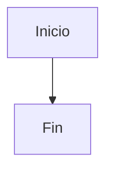

# Guia de diagramas para FD03 y FD04

Esta guia resume que tipo de grafico corresponde usar en cada informe y como representarlo con Mermaid dentro de los archivos Markdown del proyecto.

## FD03 - SRS

Referente principal: **ISO/IEC/IEEE 29148 - Software Requirements Specification**.

| Elemento del SRS | Objetivo | Mermaid recomendado | Estado esperado |
|---|---|---|---|
| Diagrama de contexto | Mostrar actores, sistema y servicios externos. | `flowchart LR` | Correcto si distingue usuarios, sistema, almacenamiento y servicios externos. |
| Casos de uso | Mostrar actores y funciones del sistema. | `flowchart LR` | Correcto como aproximacion UML en Mermaid. |
| Actividad | Representar flujo de proceso actual/propuesto. | `flowchart TD` | Correcto si usa decisiones con `{}` y rutas claras. |
| Secuencia por caso de uso | Mostrar interaccion usuario-sistema. | `sequenceDiagram` | Debe existir uno por cada caso de uso. |
| Requisitos por modulo | Relacionar RF/RNF con componentes. | Tabla Markdown | Correcto para SRS; no requiere Mermaid. |
| Matriz de trazabilidad | Vincular RF con casos de uso/modulos. | Tabla Markdown | Correcto para requisitos; no requiere Mermaid. |
| Modelo de clases/datos | Explicar entidades principales si ayuda al analisis. | `classDiagram` o `erDiagram` | Correcto si no reemplaza la especificacion textual. |

Regla practica para FD03: el grafico debe explicar **que hace el sistema** y como el usuario interactua con los requisitos.

## FD04 - SAD

Referentes principales: **C4 Model**, **arc42** e **IEEE 1016 - Software Design Description**.

| Vista del SAD | Objetivo | Mermaid recomendado | Estado esperado |
|---|---|---|---|
| Contexto | Sistema y actores externos. | `flowchart LR` o C4 si el visor lo soporta. | Correcto si muestra usuarios, sistema, Firebase, almacenamiento y despliegue. |
| Contenedores | Aplicacion web, desktop, almacenamiento y servicios. | `flowchart TB` | Correcto si separa navegador, Electron, hosting, IndexedDB, LocalStorage y Firebase. |
| Componentes | Modulos internos del sistema. | `flowchart TB` | Correcto si separa UI, store, motores, persistencia, servicios y workflows. |
| Procesos | Flujo interno de ejecucion. | `flowchart TD` | Correcto si muestra decisiones y responsabilidades. |
| Secuencia | Comunicacion entre componentes. | `sequenceDiagram` | Correcto si explica llamadas entre UI, store, motor, persistencia y resultados. |
| Datos | Entidades y relaciones persistidas. | `erDiagram` | Preferible para vista de datos. |
| Calidad | Escenarios de atributos de calidad. | Tabla Markdown | Correcto para seguridad, usabilidad, disponibilidad, adaptabilidad y escalabilidad. |

Regla practica para FD04: el grafico debe explicar **como esta construido el sistema**, no solo que funcionalidad ofrece.

## Reglas de Mermaid usadas

- Usar `flowchart TD` para procesos verticales.
- Usar `flowchart LR` para relaciones actor-sistema o arquitectura horizontal.
- Usar `sequenceDiagram` para interacciones temporales.
- Usar `classDiagram` para clases, objetos principales o tipos internos.
- Usar `erDiagram` para entidades persistidas y relaciones de datos.
- Encerrar cada grafico entre:

````markdown

````

- Evitar participantes sin alias claro en secuencia.
- Evitar flechas ambiguas: cada flecha debe tener sentido de responsabilidad o flujo.
- Si el grafico es UML pero Mermaid no tiene ese tipo exacto, usar `flowchart` como aproximacion y nombrar claramente actores, sistema y casos.
