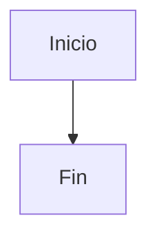

# Guia de diagramas para FD03, FD04 y FD05

Esta guia resume que tipo de grafico corresponde usar en cada informe y como representarlo con Mermaid dentro de los archivos Markdown del proyecto. Se actualiza con los diagramas ya incorporados en FD03, FD04 y el resumen arquitectonico de FD05.

## FD03 - SRS

Referente principal: **ISO/IEC/IEEE 29148 - Software Requirements Specification**.

| Elemento del SRS | Objetivo | Mermaid recomendado | Estado esperado |
|---|---|---|---|
| Diagrama de contexto | Mostrar actores, sistema y servicios externos. | `flowchart LR` | Correcto si distingue usuarios, sistema, almacenamiento y servicios externos. |
| Caso de uso general | Mostrar actores y funciones del sistema. | `flowchart LR` | Correcto como aproximacion UML en Mermaid. |
| Casos de uso especificos | Agrupar funciones por practica, datos y administracion. | `flowchart LR` | Correcto si no mezcla requisitos con diseno interno. |
| Actividad | Representar flujo de proceso actual/propuesto. | `flowchart TD` | Correcto si usa decisiones con `{}` y rutas claras. |
| Secuencia por caso de uso | Mostrar interaccion usuario-sistema. | `sequenceDiagram` | Debe existir uno por cada caso de uso. |
| Flujo de datos | Mostrar entradas, procesos, almacenamientos y salidas. | `flowchart LR` | Correcto si diferencia usuario, sistema, IndexedDB, Firebase y reportes. |
| Requisitos por modulo | Relacionar RF/RNF con componentes. | Tabla Markdown | Correcto para SRS; no requiere Mermaid. |
| Matriz de trazabilidad | Vincular RF con casos de uso/modulos. | Tabla Markdown | Correcto para requisitos; no requiere Mermaid. |
| Modelo de clases/datos | Explicar entidades principales si ayuda al analisis. | `classDiagram` o `erDiagram` | Correcto si no reemplaza la especificacion textual. |
| Estados | Describir cambios de estado de sesion, motor o simulacion. | `stateDiagram-v2` o `flowchart TD` | Correcto si muestra transiciones y eventos. |
| Wireframes | Presentar pantallas principales sin diseno visual detallado. | `flowchart TB` | Correcto si muestra zonas de pantalla y acciones principales. |

Regla practica para FD03: el grafico debe explicar **que hace el sistema** y como el usuario interactua con los requisitos.

## FD04 - SAD

Referentes principales: **C4 Model**, **arc42** e **IEEE 1016 - Software Design Description**.

| Vista del SAD | Objetivo | Mermaid recomendado | Estado esperado |
|---|---|---|---|
| Contexto | Sistema y actores externos. | `flowchart LR` o C4 si el visor lo soporta. | Correcto si muestra usuarios, sistema, Firebase, almacenamiento y despliegue. |
| Contenedores | Aplicacion web, desktop, almacenamiento y servicios. | `flowchart TB` | Correcto si separa navegador, Electron, hosting, IndexedDB, LocalStorage y Firebase. |
| Componentes | Modulos internos del sistema. | `flowchart TB` | Correcto si separa UI, store, motores, persistencia, servicios y workflows. |
| Procesos | Flujo interno de ejecucion. | `flowchart TD` | Correcto si muestra decisiones y responsabilidades. |
| Secuencia | Comunicacion entre componentes. | `sequenceDiagram` | Correcto si explica llamadas entre UI, store, motor, persistencia y resultados. |
| Datos | Entidades y relaciones persistidas. | `erDiagram` | Preferible para vista de datos. |
| Seguridad | Control de acceso y dependencias de autenticacion. | `flowchart TB` | Correcto si muestra Firebase Auth, roles, panel admin y datos locales. |
| Integracion externa | Servicios usados fuera de la app. | `flowchart LR` | Correcto si muestra Firebase, GitHub Actions, hosting y exportaciones. |
| Calidad | Escenarios de atributos de calidad. | Tabla Markdown | Correcto para seguridad, usabilidad, disponibilidad, adaptabilidad y escalabilidad. |

Regla practica para FD04: el grafico debe explicar **como esta construido el sistema**, no solo que funcionalidad ofrece.

## FD05 - Informe final

FD05 no reemplaza los diagramas completos de FD03 y FD04. Su funcion es consolidar los resultados del proyecto y presentar una vista ejecutiva.

| Seccion de FD05 | Grafico recomendado | Criterio |
|---|---|---|
| Arquitectura y diseno | `flowchart LR` | Debe resumir UI, estado, motores, persistencia, Firebase, Electron y GitHub Actions. |
| Requerimientos implementados | Tabla Markdown | Debe relacionar RF/RNF con implementacion y estado. |
| Pruebas y validacion | Tabla Markdown | Debe mostrar pruebas manuales, build, rendimiento y despliegue. |
| Resultados | Lista o tabla | Debe consolidar logros sin repetir todo FD03/FD04. |

## Reglas de Mermaid usadas

- Usar `flowchart TD` para procesos verticales.
- Usar `flowchart LR` para relaciones actor-sistema o arquitectura horizontal.
- Usar `sequenceDiagram` para interacciones temporales.
- Usar `classDiagram` para clases, objetos principales o tipos internos.
- Usar `erDiagram` para entidades persistidas y relaciones de datos.
- Usar `stateDiagram-v2` solo cuando el visor Markdown lo soporte; si no, usar `flowchart TD`.
- Encerrar cada grafico entre:

````markdown

````

- Evitar participantes sin alias claro en secuencia.
- Evitar flechas ambiguas: cada flecha debe tener sentido de responsabilidad o flujo.
- Si el grafico es UML pero Mermaid no tiene ese tipo exacto, usar `flowchart` como aproximacion y nombrar claramente actores, sistema y casos.
- Mantener nombres cortos en los nodos para evitar diagramas muy anchos en PDF.
- Evitar que FD03 contenga detalles de implementacion que corresponden a FD04.
- Evitar que FD04 describa requisitos sin explicar componentes, contenedores, datos o decisiones.

## Verificacion actual

| Documento | Diagramas cubiertos |
|---|---|
| FD03 | Contexto, casos de uso, casos especificos, actividades, flujo de datos, secuencias por caso de uso, clases, ER preliminar, estados, trazabilidad y wireframes. |
| FD04 | Arquitectura general, contexto C4, contenedores, componentes web/desktop, clases, secuencia, despliegue, integracion, seguridad, procesos, paquetes, datos y calidad. |
| FD05 | Resumen de arquitectura y tablas consolidadas de requisitos, pruebas, resultados y anexos. |
